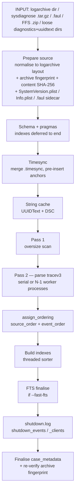
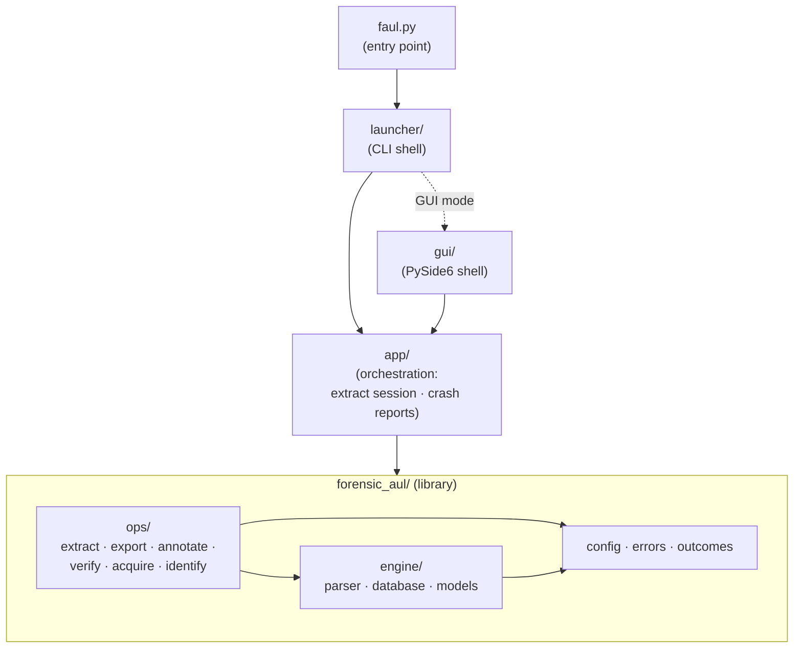

<p align="center">
  
</p>

# forensic_AUL

A digital-forensics tool that parses **Apple Unified Logs** into a normalised,
queryable **SQLite** database, preserving the byte-level provenance and the true
event timeline needed for forensic analysis. It is a Python port of the Rust
[`macos-unifiedlogs`](https://github.com/mandiant/macos-UnifiedLogs) reference
(Mandiant, Apache-2.0 — see [`THIRD_PARTY_NOTICES.md`](THIRD_PARTY_NOTICES.md)).

- **Status:** core library + CLI are functional; a PySide6 GUI is in progress
  (paused) and reuses the same core.
- **Python:** 3.11–3.14 (`uv` recommended; dev default 3.12). Runtime deps: `lz4`, `PyYAML`.

---

## Install & run

```bash
uv venv --python 3.12          # creates .venv/
source .venv/bin/activate      # Windows: .venv\Scripts\activate
uv pip install -e ".[dev]"
python faul.py --help
```

### Optional extras

The core install is deliberately light. Install extras for the features you need
(with `uv sync --extra <name>`, or add several at once with `uv sync --all-extras`):

| Extra | Adds | Install |
|---|---|---|
| `gui` | the PySide6 desktop GUI | `uv sync --extra gui` |
| `acquire` | USB iOS-device acquisition — the `acquire` command and `validate --from-device` (via `pymobiledevice3`) | `uv sync --extra acquire` |
| `dev` | the pytest test suite | `uv sync --extra dev` |

Without the `acquire` extra, `faul.py acquire` exits with a message telling you to
install it — it is **not** required for parsing an already-collected acquisition.

All commands below assume the virtual environment is **activated** (so `python`
resolves to the venv). Without activation, prefix them with the interpreter path,
e.g. `.venv/bin/python faul.py …`.

The repository is **clone-&-run**: `faul.py` is the entry point; only the
`forensic_aul/` package is published as a wheel (the `launcher/`, `gui/` layers
are app glue).

---

## The `extract` command

`extract` converts a unified-log acquisition into a SQLite database.

```bash
faul.py extract INPUT -o OUTPUT.db --case-number CASE-2024-001 --imei 35…
```

The output database is the **required `-o/--output`** (explicit for every input
mode). `--case-number` and `--imei` are also required (they name the operational
log file).

### Inputs — four acquisition types

A single positional `INPUT` is detected by **content (magic bytes), not file
extension**:

| Input | What it is | What is used |
|---|---|---|
| `*.logarchive/` directory | `log collect` / pymobiledevice3 output | used in place |
| `*.tar.gz` | **sysdiagnose** | its self-contained `system_logs.logarchive/` |
| `*.faul` | **portable container** (from `acquire`) | the bundled logarchive; its embedded sidecar **auto-fills** the case fields (see below) |
| `*.zip` | **full file system (FFS)** | `…/private/var/db/diagnostics/` + `…/private/var/db/uuidtext/` (under any root folder, e.g. `filesystem1/`) |

> **`.faul` vs FFS `.zip`:** both are zips, so detection reads the archive's
> *content* — a `.faul` carries a `faul/manifest.json` marker, and that handler is
> probed before the FFS one. A `.faul` also embeds its **acquisition sidecar**, so
> `--case-number` / `--imei` (and `--exhibit` / `--analyst` / `--notes`) are
> **optional** for a `.faul` source: they default to the sidecar values, and any
> explicit flag overrides them.

Or, when those two unified-log folders are already **uncompressed on disk**, give
them directly with `--diagnostics` / `--uuidtext` (the positional `INPUT` is then
omitted):

```bash
faul.py extract -o OUTPUT.db \
    --diagnostics path/to/private/var/db/diagnostics \
    --uuidtext   path/to/private/var/db/uuidtext \
    --case-number CASE-2024-001 --imei 35…
```

They are merged into a logarchive layout by **hard link** (zero-copy), so the
result is identical to the FFS path — the originals are only read.

> **Filesystem note (loose-dirs mode):** hard links require the work dir and the
> source folders to be on the **same** filesystem, and are unsupported on a few
> filesystems (e.g. **exFAT**) and some **network drives**. When a hard link can't
> be made, the file is **copied** instead — the result is identical, it just uses
> extra disk space and time, and a clear `WARNING` is logged. To force zero-copy,
> put `--work-dir` on the same volume as the source folders.

Archives / loose dirs are normalised into a logarchive layout in a **temporary
directory** (auto-cleaned) unless `--work-dir DIR` is given to keep the files.

### Options

| Flag | Meaning |
|---|---|
| `-o, --output OUTPUT_DB` | **Required.** Path for the output SQLite database (created or overwritten). |
| `--diagnostics DIR` / `--uuidtext DIR` | Loose-dirs source: the two uncompressed folders, given together **instead of** the positional `INPUT` (see *Inputs* above). |
| `--work-dir DIR` | Keep the extracted logarchive here instead of a temp dir. |
| `-j, --jobs N` | Parser process budget (`N-1` workers + 1 writer). **Default: auto** — the physical core count, capped at 8 (where parse throughput plateaus) and reduced further on low-memory hosts so workers do not over-subscribe RAM. `--jobs 1` forces serial. The result is identical regardless of `N`. |
| `--fast-fts` / `--no-fast-fts` | Build the full-text index once at the end instead of per-row. **Default: on** (same final DB, far less write I/O); `--no-fast-fts` maintains it incrementally so a partial run stays searchable. |
| `--fts` / `--no-fts` | Build the FTS5 full-text index at all. **Default: on**; `--no-fts` skips it entirely (message search falls back to a LIKE scan) for a smaller, faster DB. |
| `--keep-raw` | Store the per-entry `raw_data` JSON (decoded item list) for byte-level traceability. **Default: off** (it is often the fattest column). |
| `--fast-write` | `PRAGMA synchronous=OFF` for speed. **Default is safe** (`NORMAL` + WAL, never corrupts); `--fast-write` can corrupt the DB on power loss — disposable runs only. |
| `--fast` | Shortcut for `--fast-fts` + `--fast-write` (fastest, least safe; implies both caveats). |
| `--batch-size N` | Rows per DB commit batch (default 10000). |
| `--exhibit / --analyst / --notes` | Optional case metadata. |

### Pipeline



---

## Forensic concepts

### Event ordering — and why time-shifting stays visible

`timestamp_mach` is the **monotonic mach continuous time** (per boot), immune to
clock/timezone changes; `timestamp_iso`/`unix_ns` are the wall-clock values
*derived* from it via the timesync anchors. The DB carries two explicit orders,
both assigned in one pass **after** loading (so they are independent of parsing
order and identical for any `--jobs`):

- **`source_order`** — physical position **within each tracev3 file** (per-file,
  by byte offset). Paired with `tracev3_file_id` it pinpoints a record's slot in
  its own stream.
- **`event_order`** — the merged real timeline, `(boot rank, timestamp_mach)`,
  i.e. what `log show` reconstructs. It is ordered by the **monotonic clock,
  never wall-clock**, so a backwards jump in `timestamp_iso` while `event_order`
  keeps rising is preserved as a visible **time-shift / clock-tampering** signal
  rather than being silently re-sorted away. Boot order is derived from the
  *physical* timesync layout (not `boot_time`), so a clock reset cannot reorder
  boots.

Each row keeps everything needed to reconstruct and re-verify its timestamp:
`timestamp_mach`, `timesync_anchor_id` (→ the anchor's bytes/offset/timebase),
`timesync_file_id`, and `boot_uuid`.

### iOS version

`case_metadata.ios_version` is the marketing version (e.g. `17.5.1`), resolved
in priority order: the authoritative **`SystemVersion.plist`** (present in FFS and
sysdiagnose) → a best-effort build-code table (a bare logarchive carries only the
build, e.g. `21F90`, in its tracev3 header) → `None` (no guessing). The raw build
stays in `ios_build_version`.

### Shutdown events

`shutdown.log` records power-offs. Each `SIGTERM: [<epoch>]` is an exact
wall-clock power-off time, with the processes still alive at that moment. Because
these are **wall-clock-anchored** (no mach time, no boot) they cannot sit in the
`event_order` timeline, so they are stored in their own tables and correlated to
logs by wall-clock time:

- `shutdown_events(shutdown_unix_ns, shutdown_iso, delay_seconds, client_count)`
- `shutdown_clients(shutdown_event_id, pid, process_path, lingered_seconds)`

```sql
-- which processes blocked shutdown the longest, and how often
SELECT process_path, COUNT(*) AS blocked, MAX(lingered_seconds) AS worst
FROM shutdown_clients GROUP BY process_path ORDER BY worst DESC;
```

### Chain of custody

`prepare_source` records the content SHA-256 of the logarchive material and, for
archives, a quick **head+size+tail fingerprint** captured **before** extraction
and **re-verified after** the run (the evidence is only ever opened read-only).
`case_metadata` stores `source_path` (the evidence supplied), `source_type`,
`source_fingerprint`, `logarchive_sha256`, plus the sealed operational-log hash.

**Per-file integrity.** Beyond the whole-archive hash, every parsed file gets an
individual SHA-256 recorded **before** (`source_files.sha256`, at registration)
and **after** the run (`source_files.sha256_after`), with `integrity_ok` set per
file (`1` unchanged, `0` changed, `NULL` unverifiable). `run_extract` re-hashes
each source file at the end of every run; a file that changed under the parser is
flagged individually, so its data can be distrusted **without discarding the rest**
(the parser already isolates per-file parse errors). `acquire` likewise records a
per-file `file_hashes` map in its acquisition sidecar — embedded inside the
`.faul` container by default, or written as a loose `.acquisition.json` with `--raw`.

---

## Output schema (overview)

| Table | Purpose |
|---|---|
| `logs` | one row per unified-log entry (timestamps, `source_order`/`event_order`, message, FKs to the lookups, byte offsets back to source) |
| `logs_fts` | FTS5 full-text index over `logs.message` (if available) |
| `case_metadata` | one row per extraction: case ids, `source_*`, `ios_model`/`ios_build_version`/`ios_version`, log time range, hashes |
| `source_files` | every parsed file (type, size) with a **per-file SHA-256 before (`sha256`) and after the run (`sha256_after`) + `integrity_ok`** — tracev3 / uuidtext / dsc / timesync / shutdown_log |
| `timesync_anchors` | the anchors used for mach→wall-clock conversion (byte-offset provenance) |
| `shutdown_events` / `shutdown_clients` | power-off events + lingering processes |
| `processes` / `libraries` / `subsystems` / `categories` / `format_strs` | normalised lookups |

---

## Performance & safety notes

- **Multiprocessing** parallelises the (CPU-bound) parse across `jobs-1` workers,
  feeding a single SQLite writer; ordering is assigned afterwards, so output is
  deterministic for any `jobs`. The auto default caps at 8 — benchmarking showed
  parse throughput plateaus around 6 workers and regresses beyond 8 (extra
  processes add memory-bandwidth contention, not speed) — and is reduced further
  on low-memory hosts so the per-worker string caches do not exhaust RAM.
- **Indexes are built once at the end** (cheap on a finished table; an interrupted
  run still has complete, just unindexed, data). **FTS stays incremental by
  default** so an interrupted run never returns silently empty searches — defer it
  only with `--fast-fts`.
- The SQLite **sorter is multi-threaded** (`PRAGMA threads`) for the index and
  ordering passes; WAL auto-checkpoint is raised to curb write amplification.
- **Default durability never corrupts** the database; `--fast-write` trades that
  for speed.
- A **progress** callback (`forensic_aul/engine/utils/progress.py`) drives a live CLI bar
  (and is reusable by the GUI / other long commands); the parse phase is weighted
  by tracev3 byte size.

---

## Other commands

### `summary` — quick overview of an extracted DB

```bash
faul.py summary case.db [--top N] [--buckets N]
```

Prints case metadata, top processes / subsystems / log levels, annotation
counts, and a Unicode temporal histogram. Run this **before `export`** to
understand what's in the DB and decide what to filter on.

### `export` — filtered flat-file export

```bash
faul.py export case.db -o report.csv [options]
```

Exports `logs` (joined with annotations when present) to CSV, JSON, or JSONL.
Format is inferred from the output suffix; override with `--format`.

| Filter group | Flags |
|---|---|
| Time | `--from ISO` / `--to ISO` / `--last 10m\|1h\|24h\|7d` |
| Log columns | `--process P` / `--subsystem S` / `--level LVL` / `--grep LIKE_PATTERN` |
| Annotations | `--signature ID` / `--action SUBSTR` / `--tag TAG` / `--annotated-only` |
| Output | `--no-fields` (omit extracted-value columns) |

All filters are repeatable (OR within the same group). `--grep` uses SQL `LIKE`
wildcards (`%`, `_`), not regex.

### `kb` — inspect the YAML knowledge base

```bash
faul.py kb list [--tag TAG] [--process P] [--json]
faul.py kb show SIGNATURE_ID
faul.py kb validate
faul.py kb labels
faul.py kb stats
```

Read-only operations on the KB data under `knowledge_base/` (or `--kb PATH`).
`validate` checks structure **and** warns about extracted-field labels not in the
controlled vocabulary (`labels.yaml`). `kb` never touches an analysis database —
use `annotate` for that.

### `annotate` — apply KB signatures to an existing DB

```bash
faul.py annotate case.db [--kb PATH] [--signature ID] [--tag TAG]
```

Runs selected signatures against `logs`, writing matches into `kb_signatures` and
`log_annotations`. Safe to re-run: existing annotations are replaced. The KB
version + SHA-256 are stored on every run for traceability.

### `verify` — chain-of-custody verification

```bash
faul.py verify case.db [--logarchive DIR] [--log-file FILE] [--skip-files]
```

Re-hashes the logarchive (global content hash + per-file) and the operational log
file, comparing against the digests recorded at extract time. Exit code `0` = all
checks passed; `1` = at least one mismatch; `2` = invocation error. Use this
before disclosure or handover to prove evidence integrity.

> **Note:** `--logarchive` and `--log-file` override the paths read from
> `case_metadata`; supply them only if the files have moved since extraction.

### `acquire` — collect a `.faul` from a USB-connected iOS device

```bash
faul.py acquire --case-number CASE [options]
faul.py acquire --list                         # enumerate connected devices
faul.py acquire --case-number CASE --raw       # legacy loose .logarchive + sidecar
```

Requires the optional `acquire` extra (`uv pip install -e ".[acquire]"`).
Collects a `.logarchive` via pymobiledevice3, records a per-file SHA-256 manifest,
and packs the logarchive together with that traceability sidecar into a single
portable **`.faul`** container (`<case>-<imei|udid>-<UTC>.faul`). Because the
sidecar travels *inside* the container it can never be separated from the
evidence, and `extract` auto-fills the case fields from it. Optionally runs
`extract` in one step (`--extract --db CASE.db`). Use `--start-time`,
`--size-limit`, or `--age-limit` to bound the collection window.

Pass **`--raw`** (CLI-only) to instead write the legacy loose layout — a
`.logarchive` directory plus a separate `.acquisition.json` sidecar file — for a
downstream tool that needs a plain logarchive. The `.faul` is a **stored**
(uncompressed) zip, so `extract` unpacks it with a single sequential copy into a
temp dir (auto-cleaned, or kept with `--work-dir`) — no decompression cost. See
[`docs/faul-format.md`](docs/faul-format.md) for the container layout and manifest.

### `identify` / `identify-diff` — attribute log lines to a user action

```bash
# Interactive: acquire baseline → you perform the action → acquire post-action → diff
faul.py identify --case-number CASE [--baseline-window 10m] [--udid UDID]

# Diff only (no acquisition): two .logarchives or two .db files
faul.py identify-diff BASELINE ACTION [--output-prefix PREFIX]
```

`identify` orchestrates the full workflow: baseline capture, operator prompt,
post-action capture, extract both, diff. `identify-diff` runs only the diff step
on pre-existing archives or databases (auto-extracts `.logarchive` inputs on the
fly). Both write a `.csv` of retained lines and a `.db` with every post-baseline
line carrying an `excluded` flag.

### `validate` — verify FAUL against Apple's `log show`

```bash
faul.py validate <logarchive> [ref.ndjson]   # extract → diff (reference auto-made on macOS)
faul.py validate --from-device               # macOS: collect → log show → extract → diff, in one
faul.py validate <db.sqlite> <ref.ndjson>    # diff an existing DB against a reference
```

FAUL's built-in **self-check** (named `validate`, distinct from the pytest suite in
`tests/`): it runs Apple's own `log show --style ndjson` over the same logarchive
and proves every reference record is present in FAUL's database, then reports
timestamp, structural-field and message-content agreement. Use it as a QA / trust
check on a real acquisition. On macOS the reference is generated automatically;
`--from-device` runs the whole pipeline from a USB-connected iPhone (needs the
`acquire` extra — see *Optional extras*). See `faul.py validate --help` for all
options (regen reference, DB output, sample limits, allowed-missing tolerance).

### `report` — file a bug from a crash report

If FAUL hits an unexpected error, it writes a **crash report** to
`~/.config/faul/crash_reports/` capturing the traceback and the type and value of
every variable in every stack frame — enough to diagnose the bug without
reproducing it. Because this is a forensic tool, each captured variable is split
into a **`safe`** and a **`sensitive`** section (device IDs, log message content,
extracted values, case identifiers and evidence paths go to `sensitive`). The
local report keeps the real values; nothing leaves your machine automatically.

To file a bug, turn a report into a redacted, shareable pair:

```bash
faul.py report                 # list local crash reports
faul.py report <name>          # write <name>.shared.json + <name>.shared.md
```

`report` replaces every sensitive value with a type + SHA-256 placeholder and
anonymises paths. **Review the ⚠ Sensitive sections** in the generated Markdown
before attaching either file — the Markdown doubles as a fillable bug template
(steps to reproduce, expected vs actual).

---

## Architecture

Dependencies point **one way**. The entry point and the two thin shells
(`launcher/` CLI, `gui/`) depend on an `app/` orchestration layer (run-session
framing and crash reporting); `app/` depends on the `forensic_aul/` library; and
inside the library the operations layer (`ops/`) sits on top of the `engine/`
(parser + database), which sits on shared `config`/`errors`. Nothing points back
the other way, and there are no import cycles among the first-party packages.



## Using `forensic_aul` as a library

The `forensic_aul/` package is importable on its own (no CLI required) and has
**no import-time side effects**. Its public API (`run_extract`, `run_diff`,
`run_export`, `annotate_database`, `load_kb`, `prepare_source`, …) is documented in
[`forensic_aul/README.md`](forensic_aul/README.md).

## `tests/` vs `forensic_aul/testing/` — two different things

These look similar but serve opposite purposes:

| | `tests/` (repo root) | `forensic_aul/testing/` (in the package) |
|---|---|---|
| **What** | The project's **automated pytest suite** — `unit/`, `integration/`, `parser/`. | A **shipped runtime feature**: device log capture, an Apple `log show` reference exporter, and a comparator. |
| **Who runs it** | Developers / CI, during development. | End users, via the `faul test` command. |
| **Purpose** | Prove the codebase is correct as it changes. | Validate this parser's output **against Apple's own `log show`** on a real device/archive (a QA/trust check on actual evidence). |
| **Shipped in the wheel?** | No (dev-only). | Yes — it is part of the library. |

In short: `tests/` tests *the code*; `forensic_aul/testing/` lets a user test *an
acquisition* against Apple's reference output. The naming overlap is historical —
think "the test **suite**" vs "the **runtime** test feature".

Integration tests are **excluded by default** (a bare `pytest` run does a full
real extraction that takes minutes); opt in explicitly with `-m integration`.

```bash
python -m pytest tests/ -q                        # fast suite (integration auto-excluded)
python -m pytest -q -m integration                # opt-in: full extraction, needs tests/data + samples
./scripts/test_matrix.sh                          # fast suite on Python 3.11–3.14 (via uv)
python faul.py validate --help                    # the runtime validation feature
```

Supported Python is **3.11–3.14**; `scripts/test_matrix.sh` runs the unit suite on
each, and CI (`.github/workflows/ci.yml`) does the same on every push. Builds are
reproducible from the committed `uv.lock` (`uv run --frozen …`).

Coding standards, documentation conventions, and the plan/commit workflow live in
the author's `coding-rules` skill.

## Development & AI use

Generative AI was used in this project mainly to assist during the coding phase.
The original ideas and the overall structure are the owner's, and all core logic
has been reviewed. Even so, mistakes or bugs may have slipped past proof-reading —
please report anything unexpected.

## License

Copyright (C) 2026 Ben0x0a

forensic_AUL is free software: you can redistribute it and/or modify it under the
terms of the **GNU General Public License** as published by the Free Software
Foundation, either version 3 of the License, or (at your option) any later
version. It is distributed in the hope that it will be useful, but **WITHOUT ANY
WARRANTY**; without even the implied warranty of MERCHANTABILITY or FITNESS FOR A
PARTICULAR PURPOSE. See the [`LICENSE`](LICENSE) file (GPL-3.0-or-later) for the
full text, or <https://www.gnu.org/licenses/>.

This project ports and adapts the Mandiant **`macos-unifiedlogs`** library
(Apache-2.0). That code is compatible with GPLv3, and its notices are retained in
[`THIRD_PARTY_NOTICES.md`](THIRD_PARTY_NOTICES.md) and
[`licenses/macos-UnifiedLogs-LICENSE`](licenses/macos-UnifiedLogs-LICENSE).
