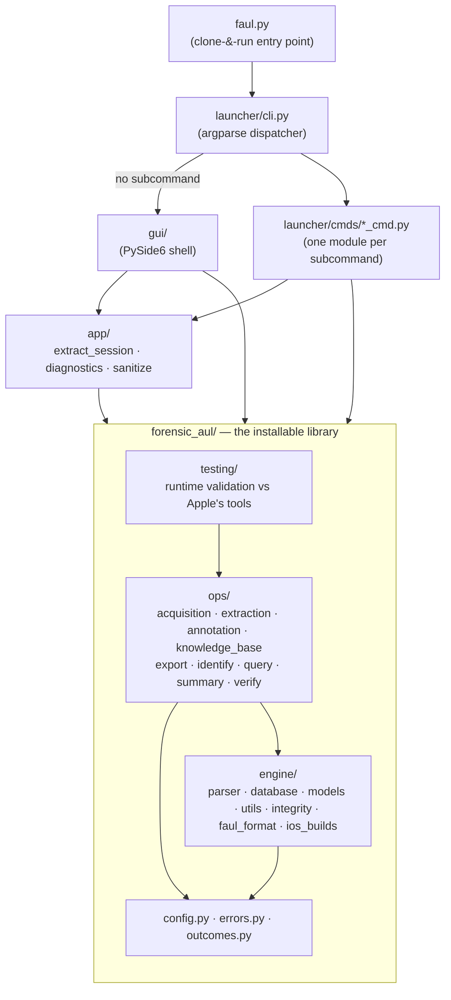

# Architecture

forensic_AUL is split into four layers with a strict one-way dependency rule:

```
faul.py  →  launcher/ · gui/  →  app/  →  forensic_aul/
                                             ops/  →  engine/  →  config · errors · outcomes
```

Nothing points back the other way, and there are no import cycles among the
first-party packages. Only `forensic_aul/` is published as a wheel; everything
above it is clone-and-run application code.

- Library API reference: [library/index.md](library/index.md)
- CLI reference: [cli/extract.md](cli/extract.md) and its siblings
- Output schema: [formats/database-schema.md](formats/database-schema.md)

---

## Dependency diagram



The GUI depends on `app/` (crash reporting) *and* directly on the library's
public API; it never imports `launcher/`. `launcher/cli.py` is the only module
that knows about both the CLI commands and the GUI entry point.

---

## Layer responsibilities

### `faul.py` — entry point

A ~30-line launcher. It puts the repository root on `sys.path` (so `launcher`,
`gui` and `forensic_aul` resolve regardless of the caller's working directory)
and calls `launcher.cli.main()`. No logic of its own.

### `launcher/` — CLI shell

`launcher/cli.py` is a **thin dispatcher**. It builds the argparse tree by
importing each module listed in `_COMMAND_MODULES` and calling that module's
`add_subcommand(sub)`, then routes the parsed namespace to the module's
`run(args)`. With no subcommand it imports `launcher.gui` and boots the GUI.
Just before dispatch it installs the crash handler from `app.diagnostics`.

Registered commands and their handler modules, in registration order — which is
the workflow order, and therefore also the order `faul.py --help` prints:

| Command | Handler module |
|---|---|
| `acquire` | `launcher/cmds/acquire_cmd.py` |
| `extract` | `launcher/cmds/extract_cmd.py` |
| `summary` | `launcher/cmds/summary_cmd.py` |
| `kb` | `launcher/cmds/kb_cmd.py` |
| `annotate` | `launcher/cmds/annotate_cmd.py` |
| `export` | `launcher/cmds/export_cmd.py` |
| `verify-hash` | `launcher/cmds/verify_hash_cmd.py` |
| `identify` (both modes, incl. `--diff`) | `launcher/cmds/identify_cmd.py` |
| `validate-tool` | `launcher/cmds/validate_tool_cmd.py` |
| `redact-errors` | `launcher/cmds/redact_errors_cmd.py` |

The handler module filenames deliberately keep their original stems; only the
public subcommand names changed.

Each `*_cmd.py` owns only CLI concerns: flag definitions, mapping flags onto the
library's option objects, terminal prompts, and mapping exceptions to exit codes.
`launcher/gui.py` owns the `QApplication` lifecycle so the widget layer stays
import-light and testable without an event loop.

### `gui/` — PySide6 desktop shell

Optional (`uv sync --extra gui`). Layout:

| Path | Responsibility |
|---|---|
| `gui/app.py` | Builds the main window; routes application logging into the log panel. |
| `gui/views/shell.py` | `MainWindow`: frameless window, sidebar, stacked screens, docked log panel. |
| `gui/views/screens_*.py`, `screen_*.py` | Views only — widget construction, input getters, display methods. |
| `gui/controllers/` | Application logic for the heavy screens (Acquire, Extract, Identify): validation, off-thread core-op invocation, result routing. |
| `gui/workers/` | `Worker` + `start_worker` — moves a blocking core call onto a `QThread`. |
| `gui/widgets/` | Reusable primitives (`LogTablePanel`, `PathPicker`, `LogPanel`, `DevicePicker`, …). |
| `gui/theme.py` | Design tokens interpolated into an application-wide Qt Style Sheet. |
| `gui/settings_store.py`, `gui/recent_store.py` | Display preferences and real recently-used paths, persisted under `~/.config/faul/`. |

Two conventions are enforced in the code:

- **Views import no `forensic_aul.ops`.** The pipeline views delegate to a
  controller; light data screens (Exploit, Identify results) call read-only ops
  inline because their reads are index-assisted and fast.
- **Widgets are never touched from a worker thread.** Worker→GUI traffic goes
  through queued Qt signals; GUI→worker control uses `threading.Event` only.

### `app/` — orchestration

Application infrastructure that is neither forensic domain logic nor a UI
concern. It may import `forensic_aul.*`; it never imports the shells, and the
library never imports it.

| Module | Responsibility |
|---|---|
| `app/extract_session.py` | The shared *session* framing around an extract: set up the forensic operational log, log the invocation banner, run the pipeline, and **seal** the log (hash → `case_metadata` → close handler) on every exit path — success, `SIGINT` or failure. Used by both `extract` and `acquire --extract`, so every route produces the same sealed audit log. |
| `app/diagnostics.py` | Forensic crash capture. Installs `sys.excepthook` + `threading.excepthook`; `capture_exception` covers the catch-log-and-return paths. Walks the traceback and records the type and value of every variable in every frame, classified `safe` / `sensitive`. Imports the **standard library only** — domain types are recognised by *name*, never imported, so it still works when a domain import is what crashed. |
| `app/sanitize.py` | Turns a full plaintext crash report into a shareable pair: `redact_report` (every sensitive value → type + SHA-256 placeholder, paths anonymised) and `render_markdown` (a scannable summary that doubles as a bug template). |

Why redaction lives in `sanitize` and not in the capture: the local report keeps
full plaintext on the operator's own machine; only the copy that leaves the
machine is redacted, and the operator reviews it first.

### `forensic_aul/` — the library

Importable on its own, with **no import-time side effects**. The package root
re-exports the whole public surface (`run_extract`, `run_export`, `query_logs`,
`annotate_database`, `prepare_source`, `verify_database`, `summarise`,
`acquire`, `run_diff`, the result dataclasses, the progress sinks…) so callers
depend on a stable surface rather than internal module paths.

#### `forensic_aul/ops/` — the operations

Each subpackage is one operation the tool can perform, and every one follows the
same shape: a main module (pure — data in, data out) plus a `report` module of
`format_*(outcome) -> str` functions.

| Package | Responsibility |
|---|---|
| `ops/acquisition/` | Collect a `.logarchive` from a USB-connected iOS device via the optional `pymobiledevice3` dependency (`device.py` = discovery/metadata, `acquire.py` = the operation, `report.py` = the acquisition sidecar). |
| `ops/extraction/` | The acquisition → SQLite pipeline: `source.py`/`sources/` (input normalisation), `timesync_setup.py`, `oversize_pass.py` (pass 1), `tracev3_parse.py` (pass 2 inner loop), `entry_builder.py` (Firehose → `LogEntry`), `workers.py` (multiprocessing), `shutdown_log.py`, `discovery.py`, `options.py`, and `extract.py` (`run_extract`). |
| `ops/knowledge_base/` | Load (`loader.py`), model (`models.py`) and lint (`lint.py`) the YAML signature library under `knowledge_base/`. |
| `ops/annotation/` | Run a loaded knowledge base against `logs`, writing `log_annotations` and `extracted_values`. Every signature pre-filters on indexed columns before any regex runs. |
| `ops/query/` | The stable read surface — `query_logs` (streamed), `LogStore` (held-open store for paging UIs), `count_logs`/`fetch_logs`, `fetch_context`, plus the shared `LogFilters` vocabulary and `LogRow` model. `reader.py` turns filters into SQL and is shared with the exporter. |
| `ops/export/` | Filtered export to CSV / JSON / JSONL through a writer registry; knowledge-base aware (extracted values become columns or nested objects). |
| `ops/identify/` | Action attribution: `diff.py` (`run_diff`), `results.py` (read/annotate a diff DB), `workflow.py` (the full interactive baseline → action → diff sequence, with all operator interaction injected as callbacks). |
| `ops/summary/` | Read-only overview of an analysis database (counts, top-N, annotation rollup, temporal histogram). |
| `ops/verify/` | Chain-of-custody re-verification: re-hash the logarchive (global + per file) and the operational log, compare against the digests stored at extract time. |

#### `forensic_aul/engine/` — the operation-agnostic backend

Nothing here knows about CLI commands, prompting, or human presentation.

| Module / package | Responsibility |
|---|---|
| `engine/parser/` | Apple Unified Log binary parsing — `reader` (the single source of all `struct.unpack` calls), `tracev3`, `header`, `catalog`, `chunkset`, `firehose`, `oversize`, `statedump`, `uuidtext`, `dsc`, `timesync`, `format_string`, `message`, `decoder_tables`, `string_cache`. See [concepts/unified-logs.md](concepts/unified-logs.md). |
| `engine/models/` | Dataclasses mirroring the Rust `macos-unifiedlogs` structs field-for-field: `chunks`, `firehose`, `strings`, `timesync`, `dumps`, `log_entry`. All re-exported from the package root. |
| `engine/database/` | `schema.py` (tables, pragmas, the `v_logs` view), `writer.py` (`BatchWriter` — lookup-table management + batched `executemany`), `ordering.py` (`assign_ordering`), `access.py` (the one validated path→connection gate). |
| `engine/utils/` | `time.py` (mach → wall-clock via timesync anchors), `progress.py` (the UI-agnostic progress standard), `logging_setup.py` (console + operational-log handlers), `system.py` (physical cores / RAM → the auto `--jobs` budget), `files.py`. |
| `engine/integrity.py` | `compute_sha256`, `hash_logarchive`, `seal_log_file`, `verify_source_files`. |
| `engine/faul_format.py` | Single source of truth for the `.faul` container — constants, `pack_faul`, the O(1) `is_faul` detector, and the readers. See [formats/faul-format.md](formats/faul-format.md). |
| `engine/ios_builds.py` | Best-effort, deliberately partial build-code → marketing-version table. Unknown builds return `None` rather than a guess. |

#### `forensic_aul/config.py`, `errors.py`, `outcomes.py`

- **`config.py`** — tunable operational defaults only (batch size, WAL
  auto-checkpoint pages, ordering batch/cache sizes, jobs auto-cap and memory
  model, hash chunk size, parser safety limits, log formats). Binary-format
  magic numbers deliberately stay in their parser modules; schema constants stay
  in `schema.py`.
- **`errors.py`** — `ForensicAULError` is the base of every purposeful library
  error, so one `except ForensicAULError` catches them all. `SourceError` and
  `InvalidDatabaseError` also subclass `ValueError` for backward compatibility.
- **`outcomes.py`** — the frozen result dataclasses returned by the top-level
  operations (`ExtractResult`, `AcquireResult`, `AnnotateResult`, `DiffResult`,
  `IdentifyResult`, `ExportResult`), kept in their own module so orchestration
  code can import them without a cycle.

#### `forensic_aul/validation/`

A shipped **runtime feature**, not the test suite: device log capture, an Apple
`log show` reference exporter, and comparators (`comparator.py`,
`merge_compare.py`, `archive_compare.py`, `ndjson_*`, `pipeline.py`,
`platform.py`). It backs the `validate-tool` command. The project's own pytest suite
lives in `tests/` at the repository root and is **not** shipped.

---

## Boundaries the code enforces

**Report modules are pure `format → str`.** Every op subpackage exposes a
`report` module whose functions build and return strings and never print. The
caller — a CLI handler, a GUI screen, a test — decides when and where to emit
them. This is what lets both frontends share one rendering.

**All prompting and pacing is frontend-bound.** Operations never ask questions
and never wait. Where a flow is interactive, the interaction is injected as
callbacks: `acquire` takes a *confirm* callback; `run_identify_workflow` takes
`confirm` / `wait_still` / `wait_for_action` / `status`. `ops/identify/__init__`
documents the call sequence a frontend composes instead of embedding the pacing.

**Progress is a sink, not a UI.** `ProgressReporter` declares weighted phases and
forwards a `ProgressEvent` to a `Callable[[ProgressEvent], None]`. `None` means
"no progress wanted" and every call becomes a no-op, so ops need no
`if progress is not None` guards. Three sinks ship with the library
(`tty_bar_sink`, `logging_progress_sink`, `callback_progress_sink`); the GUI
supplies its own.

**Errors are raised, exit codes are not.** Library operations raise
(`SourceError`, `AcquisitionError`, `InvalidDatabaseError`, `ValueError`…); the
CLI handler maps them to process exit status and user messages.

**Optional dependencies are imported lazily.** `pymobiledevice3` is only touched
when acquisition actually runs, so every other command works without it. PySide6
is only imported on the GUI path.

**Workers never open the database.** Parser worker processes resolve all DB ids
from maps prepared in the main process and return `LogEntry` batches to a single
writer. The read-only string cache is loaded from disk inside each worker rather
than pickled across, so the design works under both `spawn` and `fork`.

---

## What ships in the wheel

`pyproject.toml` restricts the distribution to `forensic_aul*`:

```toml
[tool.setuptools.packages.find]
include = ["forensic_aul*"]
```

| Component | Shipped in the wheel | Notes |
|---|---|---|
| `forensic_aul/` (incl. `testing/`) | Yes | Plus the PEP 561 `py.typed` marker. |
| `faul.py`, `launcher/`, `gui/`, `app/` | No | Clone-and-run application layer. |
| `tests/`, `scripts/`, `benchmark/` | No | Development only. |
| `knowledge_base/` (YAML tree) | No | Repo data; `annotate`/`kb` accept `--kb PATH`. |

Runtime dependencies are `lz4` and `PyYAML`. Optional extras: `gui` (PySide6),
`acquire` (pymobiledevice3), `dev` (pytest). Supported Python is 3.11–3.14.

See [getting-started.md](getting-started.md) for installation and
[library/index.md](library/index.md) for using the package as a library.
