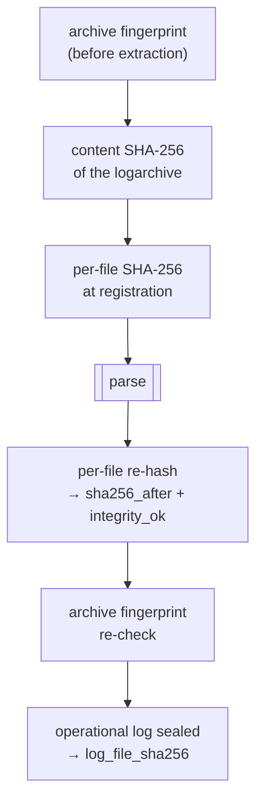

# The forensic model

What forensic_AUL guarantees about the data it produces, and how each guarantee
is implemented. The recurring principle: **record, never guess** — an
unresolvable value is stored as an explicit failure rather than a plausible
invention, and anything that could have been tampered with is made visible
instead of being smoothed away.

See also [../formats/database-schema.md](../formats/database-schema.md) for the
full column list, [unified-logs.md](unified-logs.md) for the parsing side, and
[../cli/verify-hash.md](../cli/verify-hash.md) for the verification command.

---

## Two clocks, and why only one of them can be trusted

Apple Unified Logs are written against the **mach continuous time** — a
monotonic per-boot tick counter that is immune to timezone changes, NTP
corrections and deliberate clock tampering. Wall-clock time is *not* stored on
the record; it is **derived**.

| Column | What it is |
|---|---|
| `timestamp_mach` | The raw mach continuous time (kernel ticks). Primary evidence. |
| `timestamp_unix_ns` | Nanoseconds since 1970-01-01 UTC, **derived** from `timestamp_mach` via a timesync anchor. |
| `timestamp_iso` | The ISO 8601 UTC rendering of the same value. |

Because the wall clock is derived, an analyst must be able to re-derive it. Every
row therefore keeps the whole derivation chain:

| Column | Points to |
|---|---|
| `timestamp_mach` | the input value |
| `timesync_anchor_id` | → `timesync_anchors` — the exact anchor used |
| `timesync_file_id` | → `source_files` — the `.timesync` file |
| `boot_id` | → `boots` — the boot the record belongs to |

The `timesync_anchors` table stores, per anchor, the source file id, the **byte
offset** inside that file, the boot UUID, `kernel_continuous_time`,
`walltime_unix_ns`, the timebase numerator/denominator and the timezone offset.
`UNIQUE(timesync_file_id, file_offset)` makes byte-level provenance the natural
deduplication key — a single anchor is shared by every entry in its window, so
the table stays small while every row still points at a specific byte range in a
specific file.

That is enough to redo the arithmetic by hand:

```
timestamp_unix_ns = anchor.walltime_unix_ns
                  + (timestamp_mach − anchor.kernel_continuous_time)
                    × anchor.timebase_numerator ÷ anchor.timebase_denominator
```

The computation uses integer arithmetic throughout, so nanosecond precision is
exact — no floating-point drift.

### When resolution fails

An unknown boot UUID or the absence of a usable anchor yields a failure
resolution: `timestamp_unix_ns = 0`, an epoch ISO string, and a **NULL**
`timesync_anchor_id`. The row is still written. At the end of the run the count
of such rows is logged explicitly:

```
WARNING  Unresolved timestamps : N entries have timestamp_unix_ns=0
         (excluded from the reported time range; rows kept in the DB)
```

The reported `log_start_time` / `log_end_time` are computed over
`timestamp_unix_ns > 0` only, so unresolved rows cannot drag the time range back
to 1970 — but they remain queryable and are never silently dropped.

---

## Timesync anchors

`.timesync` files hold **boot records** (`0xBBB0`) each followed by periodic
**timesync records** (`0x207354`) that pin a mach tick value to a wall-clock
instant. Anchor selection (`engine/utils/time.py`) works as follows:

| Situation | Anchor |
|---|---|
| The firehose preamble's `base_continuous_time` is `0` | The **boot record itself** — `kernel_continuous_time = 0`, `walltime = boot_time`. The anchor's `file_offset` is the boot header's offset. |
| Otherwise | The timesync **record** with the largest `kernel_time` that is **≤** the queried continuous time. |

Two details protect anchor provenance:

- A boot UUID may appear in **more than one** `.timesync` file. Merging appends
  records rather than replacing the list (`merge_timesync_dicts`, not
  `dict.update`) — replacing would silently lose anchors.
- `timesync_file_id` travels on **each record and boot header**, not on the boot
  as a whole, so a boot spanning two files attributes each anchor to the file it
  actually came from.

All anchors are pre-inserted into the database in step 4 of the pipeline, before
parsing begins. That is what lets parser worker processes resolve
`timesync_anchor_id` with a pure in-memory map lookup and **never open the
database**.

---

## Ordering: `source_order` vs `event_order`

Both columns are filled by `assign_ordering` (`engine/database/ordering.py`)
**after** the bulk load completes. This is deliberate: the ordering is then
independent of insertion order, and therefore **identical for any `--jobs`
value**. Parallelism cannot change the result.

| Column | Definition |
|---|---|
| `source_order` | Physical position **within each tracev3 file** — 1-based, partitioned by `tracev3_file_id`, ordered by `tracev3_chunkset_file_offset`, then `tracev3_firehose_inner_offset`, then `tracev3_entry_inner_offset`, then `id`. |
| `event_order` | The merged real timeline: ordered by `(boot rank, timestamp_mach)`, tied by physical position then `id`. |

**`source_order`** answers "where is this record in its own stream?". Paired with
`tracev3_file_id` it pinpoints a record's exact byte slot — the truest "as it is
in the source". Records with NULL offsets (e.g. `Loss` entries) sort first within
their file.

**`event_order`** answers "what actually happened, in what order?" — it is what
`log show` reconstructs. Crucially it is ordered by the **monotonic** clock,
**never** by wall-clock.

### Why time-shifting stays visible

If `event_order` were derived from `timestamp_iso`, a device whose clock was
moved backwards would have its records silently re-sorted into a plausible-looking
sequence, and the tampering would vanish from the output.

Sorting on `timestamp_mach` instead means the two orders **disagree** when the
clock was changed:

```
event_order   timestamp_iso              interpretation
─────────────────────────────────────────────────────────
 1 000 001    2024-06-01T10:00:00Z
 1 000 002    2024-06-01T10:00:01Z
 1 000 003    2024-05-20T08:12:00Z   ←  wall clock jumped BACKWARDS
 1 000 004    2024-05-20T08:12:01Z       while event_order kept rising
```

A backwards jump in `timestamp_iso` while `event_order` keeps increasing is the
**tamper signal**. It is preserved, not repaired.

### Boot ordering comes from the physical layout

`event_order` leads with a boot rank, and that rank must itself be
tamper-resilient. It is **not** derived from `boot_time` (wall-clock at boot),
which a clock reset could reorder.

Instead, `boots.rank` is the **physical first-appearance order**: the pipeline
walks the name-sorted `.timesync` files (which are append-only and
sequence-numbered) and, within each file, the boot records in byte-offset order,
assigning ranks `0, 1, 2, …` on first sight of each boot UUID
(`ops/extraction/timesync_setup.py`).

A boot that appears in the logs but is absent from the timesync layout is
inserted with `rank = UNKNOWN_BOOT_RANK` (`1 << 30`, in `schema.py`), so it sorts
**after** every known boot rather than being interleaved on a guess. The same
constant is the `COALESCE` fallback in `assign_ordering` for a row with no
`boot_id` at all.

### Implementation notes

`assign_ordering` computes both orderings in a single `SELECT` with two
`ROW_NUMBER()` window functions into a TEMP table, then writes back in id-range
batches (`ORDERING_UPDATE_BATCH_ROWS`), committing and `wal_checkpoint(TRUNCATE)`
after each. The batching exists purely to cap the WAL — a single transaction over
tens of millions of rows grew the WAL to a whole-table rewrite (~24 GB observed)
and filled the disk. The ordering is fully materialised before any write-back, so
batching cannot change the result. The pass is **idempotent**: a crash mid-pass
leaves some `event_order` NULL, and re-running completes it.

---

## iOS version resolution

`case_metadata` keeps the raw build code and the marketing version separately:

| Column | Value |
|---|---|
| `ios_build_version` | The build code from the tracev3 header sub-chunk `0x6101`, e.g. `21F90`. Always the raw fact. |
| `ios_version` | The marketing version, e.g. `17.5.1`. May be `None`. |
| `ios_model` | The hardware model string from the same header sub-chunk. |

`ios_version` is resolved in strict priority order
(`ops/extraction/extract.py`):

1. **`SystemVersion.plist`** — authoritative. Present in FFS zips
   (`System/Library/CoreServices/SystemVersion.plist`) and sysdiagnose tarballs
   (`logs/SystemVersion/SystemVersion.plist`). Read during source preparation
   and carried on `PreparedSource.ios_product_version`.
2. **The build-code table** (`engine/ios_builds.py`) — best-effort. A bare
   `.logarchive` and a `.faul` carry only the build code, so this maps it back to
   a human version as a convenience.
3. **`None`** — no guessing. The raw build code still stands on its own in
   `ios_build_version`.

The lookup table is **deliberately partial** and documented as such: new builds
ship constantly, an unknown build returns `None`, and the module tells you to
verify entries against Apple's published build list before relying on them in a
report. `SystemVersion.plist` remains the authoritative source.

---

## Shutdown events are stored separately

`shutdown.log` is a plain-text sidecar recording each power-off (under `Extra/`
in a logarchive or sysdiagnose, at the root for an FFS source). During shutdown
`logd` polls who is still alive and writes blocks like:

```
After 0.63s, these clients are still here:
    remaining client pid: 215 (/System/.../destinationd/<uuid>)
    remaining client pid: 0 (/kernel/<uuid>)
After 2.62s, these clients are still here:
    remaining client pid: 0 (/kernel/<uuid>)
SIGTERM: [1774602168] All buffers flushed
```

The `SIGTERM: [<epoch>]` line is an exact **Unix epoch in seconds** — a
wall-clock power-off time. A file may contain several such events (several
boots).

**Why these are not merged into `logs`:** a shutdown record is *wall-clock
anchored*. It has no mach continuous time and no boot UUID, so it cannot be
placed on the `(boot rank, timestamp_mach)` `event_order` timeline without
misrepresenting it. Forcing it in would mean inventing a mach value.

They therefore live in their own two tables and are correlated to logs by
wall-clock time:

| Table | Columns |
|---|---|
| `shutdown_events` | `source_file_id`, `shutdown_unix_ns`, `shutdown_iso`, `delay_seconds`, `client_count` |
| `shutdown_clients` | `shutdown_event_id`, `pid`, `process_path`, `lingered_seconds` |

For each event the parser captures the **union** of every process seen across the
"After Xs" checks, and how long each lingered (the largest check it appeared in),
so an analyst can ask which process blocked shutdown most or longest.

---

## Chain of custody

The evidence is only ever opened **read-only**. Four independent attestations are
recorded.



### 1. Archive fingerprint — before and after

For single-file archives (sysdiagnose, `.faul`, FFS zip) a **quick fingerprint**
is captured *before* extraction: `sha256(first 64 KiB ‖ decimal file size ‖ last
64 KiB)`. It is cheap enough to recompute after a long run, and its shape is
chosen for the job — a zip's central directory lives in the tail, and the
embedded size catches truncation.

At the end of the run `PreparedSource.verify_unchanged()` recomputes it:

```
INFO     Archive integrity re-check : PASS — unchanged since pre-run snapshot
WARNING  Archive integrity re-check : FAIL — <path> changed during the run!
```

Since the tool only ever reads the evidence, a mismatch means it was modified
externally during the run and the result must be treated with caution.

A `.logarchive` directory and loose dirs have no single archive file to attest,
so `archive_fingerprint` is `None` and the check reports pass vacuously.

### 2. Content SHA-256 of the logarchive

`hash_logarchive()` is a deterministic whole-tree fingerprint: it walks the root
in **sorted path order** and, for each regular file, folds in **both its relative
path and its content digest** (`path ‖ NUL ‖ digest`). It returns the global
digest and the per-file map. Symlinks are skipped — following them could pull in
files outside the root and make the hash non-reproducible.

Paths are part of the hash because a file's *name* is part of the evidence:
hashing digests alone would let a rename that keeps the file's position in sorted
order produce an identical global hash, declaring the archive unchanged when a
file had been renamed.

Paths are **relative to the logarchive root**, so moving or copying the whole
archive elsewhere does not change its hash — only a change *inside* it does.
(`verify-hash` locates the archive via the absolute `case_metadata.logarchive_path`,
so after a move you point it at the new location with `--logarchive`; the hash
itself still matches.)

When the global hash fails, `verify-hash` reports *which kind* of change it is —
content altered, a recorded file no longer at its recorded path, or paths
differing while every recorded digest still matches — rather than a bare
"mismatch" on the check most likely to be read as tampering.

The result lands in `case_metadata.logarchive_sha256` and seeds
`source_files.sha256`.

### 3. Per-file integrity

Beyond the whole-archive hash, every parsed file gets its own before/after
attestation in `source_files`:

| Column | Meaning |
|---|---|
| `sha256` | the "before" digest, captured at registration |
| `sha256_after` | re-hashed at the end of the run by `verify_source_files` |
| `integrity_ok` | `1` unchanged · `0` **changed during the run** · `NULL` no baseline, or unreadable at verification time |

`file_type` distinguishes `tracev3`, `uuidtext`, `dsc`, `timesync` and the
shutdown log.

The point of per-file granularity is **containment**: a file that changed under
the parser is flagged individually, so its data can be distrusted **without
discarding the rest**. The parser already isolates parse errors per file, so the
other rows stay independently usable. `ExtractResult` reports the three counts as
`source_files_verified` / `source_files_changed` / `source_files_unverifiable`.

A changed file is also logged at the moment it is detected:

```
WARNING  integrity: <path> CHANGED during the run (before=… after=…)
```

### 4. What `case_metadata` records

One row per extraction:

| Column group | Columns |
|---|---|
| Case identity | `case_number`, `imei`, `exhibit_number`, `analyst_name`, `notes` |
| Device | `ios_model`, `ios_build_version`, `ios_version` |
| Evidence | `source_path`, `source_type`, `source_fingerprint`, `logarchive_path`, `logarchive_sha256` |
| Audit log | `log_file_path`, `log_file_sha256` |
| Run | `log_start_time`, `log_end_time`, `acquisition_timestamp`, `tool_version` |

`logarchive_path` holds the placeholder `"(temporary directory — not retained)"`
when the material was extracted into an auto-cleaned temp dir — a dangling path
would be a misleading reference. Use `--work-dir` if you intend to re-verify the
extracted material later.

### Acquisition-side provenance

`acquire` records a per-file `file_hashes` map in its acquisition sidecar —
embedded **inside** the `.faul` container by default, so it cannot be separated
from the evidence, or written as a loose `.acquisition.json` with `--raw`. See
[../formats/acquisition-sidecar.md](../formats/acquisition-sidecar.md).

---

## Integrity modes

Hashing a multi-gigabyte acquisition costs real time, and not every run is an
evidentiary one. `prepare_source(..., integrity=…)` selects the level:

| Mode | Archive fingerprint | Content + per-file SHA-256 | Use for |
|---|---|---|---|
| `"full"` (default) | yes | yes | Evidentiary extraction. Full chain of custody; `verify-hash` can re-check everything later. |
| `"fingerprint"` | yes | no | A fast run that still detects the source archive changing underneath it. `logarchive_sha256` is NULL and `source_files.sha256` is NULL, so `verify-hash` will report those checks as skipped and per-file verification is impossible. |
| `"off"` | no | no | Throwaway/research runs. **No attestation at all.** |

An invalid mode raises `SourceError` immediately rather than falling back to a
default — a typo like `"none"` would otherwise either waste minutes of hashing or
skip an attestation the operator believed they had taken. The reduced modes log
an explicit line:

```
INFO  Integrity mode 'fingerprint': per-file hashing skipped —
      no chain-of-custody attestation
```

The reduced modes record **NULL** hashes rather than a fabricated baseline, so a
later `verify-hash` reports honest "none stored" skips instead of false passes.

The interactive `identify` workflow defaults to `integrity="off"` on purpose: it
is a research tool, not a chain-of-custody acquisition, and the hashing would
dominate the interactive loop. Pass `integrity="full"` / `"fingerprint"` to
restore the evidentiary paperwork.

---

## The operational log file

Every extract session writes a forensic **operational log** — an audit trail of
what the tool did, in the same directory as the output database:

```
<case_number>-AUL-<imei>.log
```

This is why `--case-number` and `--imei` are required: they name the file.
Special characters are sanitised to underscores so the name is valid on Windows
and macOS. Two handlers are configured (`engine/utils/logging_setup.py`):

| Handler | Level | Format |
|---|---|---|
| Console | INFO, or DEBUG with `-v` | includes filename, line number, function and process info, for debugging |
| File | always INFO | clean UTC timestamp + level + message — an operational audit trail |

The file is opened in **append** mode: successive runs on the same case
accumulate in one file and no run is ever lost.

### Sealing

`app/extract_session.py` frames every extract — whether launched as `extract` or
as `acquire --extract` — and **seals** the log on every exit path: success,
`SIGINT`, or failure. Sealing means `seal_log_file` SHA-256s the log and writes
the digest plus the path into `case_metadata` (`log_file_sha256`,
`log_file_path`), then closes the file handler.

Centralising this in one session runner is what guarantees that however an
extract is launched, it produces the same tamper-evident, sealed audit log.
Because the digest is written *after* the log is complete, editing the log
afterwards is detectable.

---

## Re-verification: the `verify-hash` command

`verify_database` re-runs the attestations against the digests stored at extract
time and returns a structured `VerifyResult`. It performs:

| Check | Result states |
|---|---|
| logarchive global SHA-256 | `ok` · `fail` (mismatch, directory missing, unhashable, or no path stored) · `skip` (none stored). A mismatch names which kind of change it is: content altered, a file moved from its recorded path, or paths differing with all recorded content intact |
| per-file SHA-256 (`source_files`) | counted as matched / mismatched / missing file / missing stored hash |
| operational log SHA-256 | `ok` · `fail` (mismatch or file missing) · `skip` (no path or no stored digest) |

`--logarchive` and `--log-file` override the paths read from `case_metadata` —
supply them only if the files have moved since extraction. `--skip-files` runs
the global checks only.

The result's `ok` property is `failed == 0`, where a file with **no** stored hash
counts as neither pass nor fail (`missing_hash`) while a stored hash whose file
is **absent** counts as a failure. The CLI maps that to exit codes:

| Exit code | Meaning |
|---|---|
| `0` | all checks passed |
| `1` | at least one mismatch or missing file |
| `2` | invocation error (database unreadable, schema invalid) |

Run it before disclosure or handover to demonstrate that the evidence and the
audit log are unchanged.

---

## Summary of the guarantees

| Guarantee | Mechanism |
|---|---|
| Timestamps are reproducible | `timestamp_mach` + anchor id + file id + byte offset stored per row |
| Clock tampering stays visible | `event_order` sorts on the monotonic clock, never wall-clock |
| Boot order survives a clock reset | `boots.rank` comes from the physical timesync layout, not `boot_time` |
| Output is independent of parallelism | Ordering assigned in one pass after the bulk load |
| Evidence is never modified | Read-only access; fingerprint captured before and re-checked after |
| A damaged file does not poison the rest | Per-file `integrity_ok` and per-file parse-error isolation |
| Nothing is invented | Unresolved timestamps stored as 0 with a NULL anchor; unknown iOS build → `None`; reduced integrity modes store NULL, not a fabricated baseline |
| The tool's own actions are auditable | Append-mode operational log, SHA-256-sealed into `case_metadata` on every exit path |
