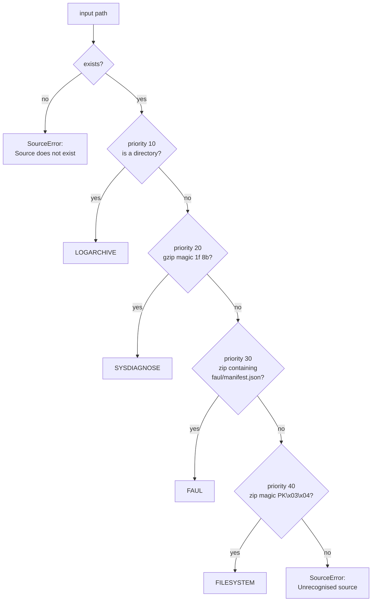

# Acquisition sources

`extract` accepts several kinds of evidence container. All of them are
normalised into a single shape — a directory laid out like a `.logarchive` —
before any parsing happens, so the parser only ever sees one layout.

The whole layer lives in `forensic_aul/ops/extraction/sources/`, with
`forensic_aul/ops/extraction/source.py` kept as a backwards-compatibility shim
re-exporting the same names.

Related: [unified-logs.md](unified-logs.md) (what the normalised layout
contains), [../cli/extract.md](../cli/extract.md) (the flags),
[../formats/faul-format.md](../formats/faul-format.md) (the `.faul` container),
[../formats/acquisition-sidecar.md](../formats/acquisition-sidecar.md).

---

## Supported sources

| `SourceType` | Input | Detection | What is used |
|---|---|---|---|
| `LOGARCHIVE` | a `.logarchive` **directory** | any directory | used **in place**, nothing copied |
| `SYSDIAGNOSE` | a sysdiagnose `.tar.gz` | gzip magic `1f 8b` | the `system_logs.logarchive/` inside it |
| `FAUL` | a `.faul` portable container | zip magic **plus** a `faul/manifest.json` entry | the bundled logarchive; its embedded sidecar auto-fills case fields |
| `FILESYSTEM` | a full-file-system `.zip` | zip magic `PK\x03\x04` | `private/var/db/diagnostics/` + `private/var/db/uuidtext/` |
| `LOOSE_DIRS` | two uncompressed folders | **never auto-detected** — passed explicitly | the two folders, merged into one root |

Only the first four are detected. `LOOSE_DIRS` is requested explicitly, either
with the CLI's `--diagnostics` / `--uuidtext` flags or, from the library, by
passing a mapping:

```python
from forensic_aul import run_extract

run_extract(
    {"diagnostics": diag_dir, "uuidtext": uuidtext_dir},
    Path("case.db"),
    case_number="CASE-2024-001",
)
```

`find_loose_dirs(fs_root)` builds that mapping for you from an already-extracted
full file system.

---

## Content-based detection

**Extensions are never trusted on their own.** `detect_source_type(path)` asks
each registered handler's `matches(path)` predicate in priority order and
returns the first match:



The ordering matters in exactly one place: **a `.faul` is also a zip**. Both
would match the FFS handler's magic-byte test, so the `.faul` handler is
registered at priority 30 — ahead of FILESYSTEM's 40 — and discriminates on the
archive's *content*, the presence of `faul/manifest.json` in the zip's central
directory. That check is O(1): it reads the central directory only, never the
payload.

The `SourceError` message for an unrecognised path is assembled from the
handlers' own `describe` strings, so it always lists exactly what is supported.

### Adding a source type

Drop a module in `sources/` exposing
`HANDLER = SourceHandler(source_type=…, priority=…, matches=…, prepare=…, describe=…)`
and add it to `_HANDLERS` in `sources/__init__.py`. Detection, preparation and
the error message all follow — no other file changes.

---

## Normalisation into a logarchive layout

Every handler produces a `PreparedSource`:

| Field | Meaning |
|---|---|
| `source_type` | the detected `SourceType` |
| `original_path` | the evidence the analyst supplied |
| `logarchive_root` | the directory laid out as a logarchive, ready to parse |
| `content_sha256` | `hash_logarchive()` fingerprint; `None` in non-`full` integrity modes |
| `file_hashes` | relative path → SHA-256 (`{}` in non-`full` modes) |
| `archive_fingerprint` | quick pre-extraction fingerprint; `None` for LOGARCHIVE / LOOSE_DIRS |
| `ios_product_version` | authoritative `ProductVersion` when the container carried a `SystemVersion.plist` |
| `archive_identifier` | `ArchiveIdentifier` from the logarchive's `Info.plist`, if any |
| `sidecar` | the acquisition sidecar embedded in a `.faul`; `None` for every other source |

It is a **context manager**: `with prepare_source(...) as src:` removes any temp
directory it created on exit. For a LOGARCHIVE nothing was copied, so there is
nothing to clean up.

### What each handler does

**LOGARCHIVE** — the simplest case: the directory is parsed where it sits. No
copy, no archive fingerprint (there is no single archive file to attest). A bare
logarchive carries no `SystemVersion.plist`, so `ios_product_version` stays
`None` and extraction falls back to the tracev3 build code.

**SYSDIAGNOSE** — streams the tarball once. Entries are matched on the
well-known directory name `system_logs.logarchive/` (not on the wrapper folder,
whose name varies), and that prefix is stripped so the work root itself *becomes*
the logarchive. In the same pass it opportunistically reads
`logs/SystemVersion/SystemVersion.plist` for the authoritative iOS version.
Symlink and hardlink members are skipped. If no `system_logs.logarchive/`
content is found at all, a `SourceError` is raised rather than producing an empty
database.

**FILESYSTEM (FFS `.zip`)** — matches entries under `private/var/db/diagnostics/`
and `private/var/db/uuidtext/`, requiring the marker at the start of a path or on
a `/` boundary so a file merely *named* like the marker cannot be mistaken for
the directory. Whatever precedes the marker (`filesystem1/`, or nothing) is the
root prefix; entries are folded onto the logarchive root with the prefix removed.
If several roots contain a `diagnostics/` tree, the lexically first is chosen
**deterministically** and a `WARNING` names the alternatives. iOS version comes
from `System/Library/CoreServices/SystemVersion.plist`. Zip symlink entries
(unix mode in the high 16 bits of `external_attr`) are skipped.

**FAUL** — delegates to `engine/faul_format.py` to extract the bundled logarchive
and read the embedded sidecar. Because a `.faul` bundles a plain logarchive with
no `SystemVersion.plist`, `ios_product_version` is left `None` and extraction
falls back to the build code, exactly as for a bare logarchive directory. The
`.faul` is a **stored** (uncompressed) zip, so unpacking is a sequential byte
copy with no decompression cost.

**LOOSE_DIRS** — both paths are validated as directories, then each tree is
mirrored into one work root by `mirror_tree` (see below). If the two together
hold no files, a `SourceError` is raised. `ios_product_version` is `None` —
`SystemVersion.plist` lives outside these two folders.

### Archive extraction is path-safe

Every archive handler resolves each entry through `safe_target(root, rel)`, which
resolves the destination and refuses anything that escapes the work root. This
blocks zip-slip / tar-slip: archives are untrusted forensic input, and a crafted
`../` entry would otherwise write outside the work directory.

---

## Work dir vs temp dir

Archive and loose-dirs sources have to materialise files somewhere.
`make_work_root(name, work_dir)` decides where:

| `--work-dir` given | Destination | Cleanup |
|---|---|---|
| yes | `<work_dir>/<evidence stem>.logarchive/` | **kept** — inspect or re-run against it |
| no | a `tempfile.TemporaryDirectory(prefix="faul_source_")` | auto-removed when the `PreparedSource` closes |

The kept directory is named after the evidence so a retained work dir is
self-describing.

Because a temp dir is gone after the run, `case_metadata.logarchive_path` records
the placeholder `"(temporary directory — not retained)"` rather than a dangling
path — a misleading reference is worse than an explicit one. Use `--work-dir`
when you intend to run `verify-hash` against the extracted material later.

If extraction or hashing fails partway, the temp dir is cleaned up before the
exception propagates, so a failed run never leaks gigabytes.

---

## Hard links, and when they are not available

For LOOSE_DIRS, `mirror_tree` recreates the source tree under the work root by
**hard-linking** each regular file. A hard link is a second name for the same
on-disk data, so multi-gigabyte `.tracev3` files are not duplicated — the
operation is effectively zero-copy, and the originals are only ever read.

Hard links rather than symlinks, deliberately:

- a hard link is indistinguishable from a regular file — `is_symlink()` is
  `False` and `is_file()` is `True` — so the forensic hasher (which skips
  symlinks) still hashes it and `source_files` is populated;
- it avoids `rglob`'s follow-symlinked-directory behaviour, which differs across
  Python 3.11–3.14.

Source symlinks are skipped: a logarchive holds only regular files, and following
one could pull in data from outside the evidence.

### Filesystem caveats

Hard links **never span volumes** and are unsupported on some filesystems —
notably **exFAT** and certain **network shares**. When `os.link` fails, the file
is **copied** instead:

- the result is byte-identical; only disk usage and time differ;
- a clear `WARNING` is logged naming how many of the files were copied and how
  to avoid it;
- if the copy also fails, an `OSError` is raised naming the file, the work root
  and the underlying reason.

```
WARNING  Loose dirs: hard links unavailable — copied N of M file(s) into the
         work root instead (extra disk used; result is identical). To enable
         zero-copy, point --work-dir at the same filesystem as the source folders.
```

To force zero-copy, put `--work-dir` on the same volume as the source folders.
When every file links, the log instead reports
`hard-linked N file(s) into a logarchive root (zero-copy)`.

---

## Sidecar auto-fill for `.faul`

`extract` normally requires `--case-number` and `--imei` — they name the
operational log file. A `.faul` container embeds its acquisition sidecar, so
those fields can be omitted for that source type.

`_resolve_case_fields` in `launcher/cmds/extract_cmd.py` merges the two, with
**an explicit flag always winning**:

| Field | Sidecar source |
|---|---|
| `--case-number` | `sidecar["case"]["case_number"]` |
| `-e, --exhibit-number` | `sidecar["case"]["exhibit_number"]` |
| `--analyst` | `sidecar["case"]["analyst"]` |
| `--notes` | `sidecar["case"]["notes"]` |
| `--imei` | `sidecar["device"]["imei"]` |

When anything was filled in this way, an INFO line records it in the operational
log:

```
Case fields auto-filled from the .faul acquisition sidecar (explicit flags override).
```

`load_sidecar_for(path)` (in `ops/acquisition/report.py`) is the single lookup
used by both the CLI and the GUI. It reads the sidecar from *inside* a `.faul`,
or from the loose `<name>.logarchive.acquisition.json` file next to a legacy
`--raw` acquisition. It is best-effort: a missing or malformed sidecar returns
`None` rather than raising, so callers treat "no sidecar" and "bad sidecar"
alike. Loose-dirs sources are skipped outright — a mapping has no sidecar.

Because the sidecar travels *inside* the `.faul`, it cannot be separated from the
evidence it describes.

---

## Integrity modes

`prepare_source(..., integrity=…)` selects how much hashing is done. An invalid
value raises `SourceError` immediately rather than silently defaulting — a typo
like `"none"` would otherwise either waste minutes of hashing or skip an
attestation the operator believed they had.

| Mode | Archive fingerprint | Per-file + content SHA-256 |
|---|---|---|
| `"full"` (default) | yes | yes |
| `"fingerprint"` | yes | no — `content_sha256` is `None`, `file_hashes` is `{}` |
| `"off"` | no | no |

In the reduced modes the downstream consumers record NULL hashes rather than a
fabricated baseline, and an INFO line states that no chain-of-custody attestation
was taken. See [forensic-model.md](forensic-model.md#integrity-modes) for the
trade-offs and when each is appropriate.
