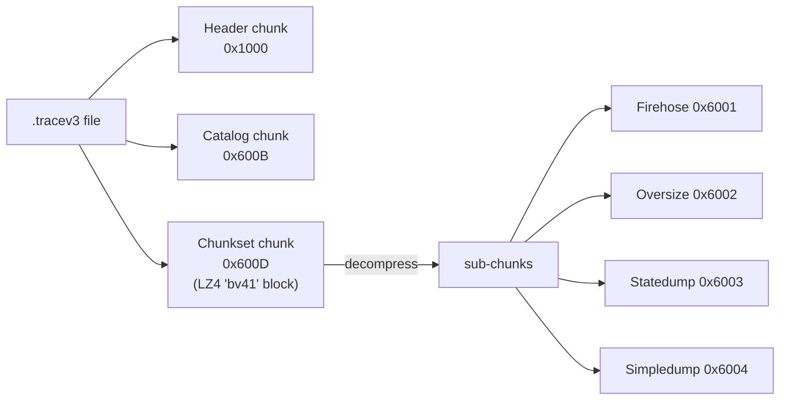
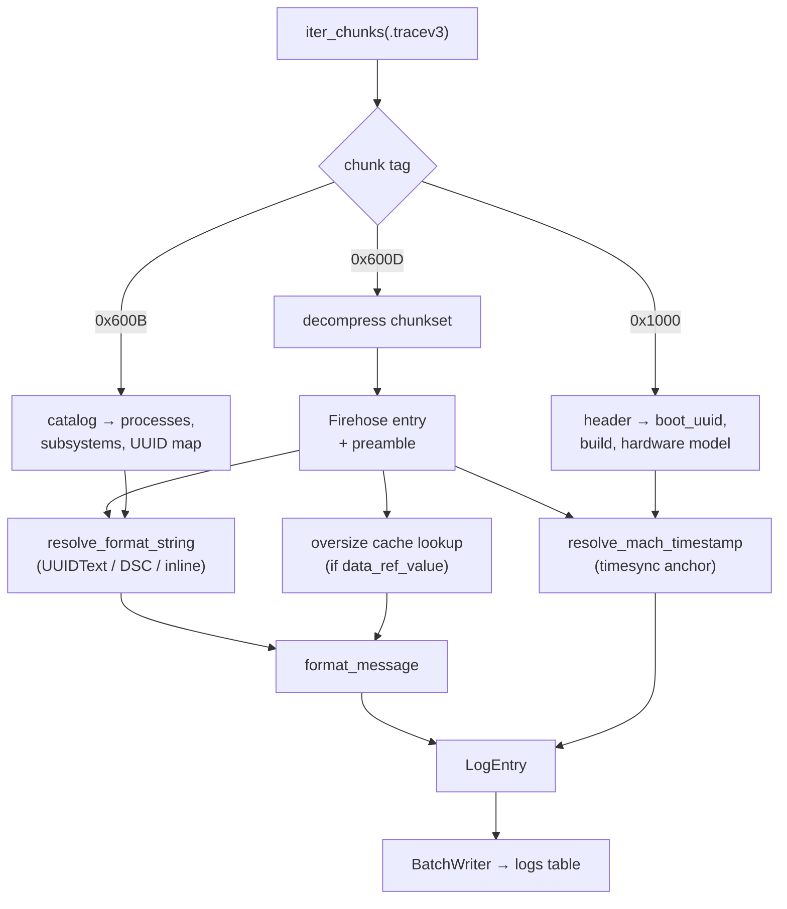

# The Apple Unified Log format

A conceptual primer on the on-disk format, as implemented in
`forensic_aul/engine/parser/`. This is not a byte-level specification — it
explains what each file in a `.logarchive` is, how they fit together, and what
the parser does with them, so an analyst can reason about the output and a
developer can find the right module.

The implementation is a Python port of Mandiant's Rust
[`macos-unifiedlogs`](https://github.com/mandiant/macos-UnifiedLogs); every
parser module names the Rust file it mirrors in its docstring, and the models in
`engine/models/` mirror the Rust structs field-for-field so the two can be
diffed.

---

## Why the format looks like this

Apple's unified logging stores log records in a **binary, deduplicated** form.
The single most important consequence: **a log line's text is not stored with the
log line**. What is stored is a reference to a printf-style *format string* held
in a separate file, plus the argument values. Reconstructing a human-readable
message therefore requires three independent inputs:

1. the record itself (in a `.tracev3` file),
2. the format string (in a `UUIDText` or `dsc` file),
3. a mach-time → wall-clock mapping (in a `.timesync` file).

Lose any one of them and the log is partially unreadable. This is why an
acquisition must capture the whole `diagnostics/` + `uuidtext/` pair — see
[sources.md](sources.md).

---

## What is inside a `.logarchive`

| Path | Contents | Parsed by |
|---|---|---|
| `Persist/*.tracev3` | The long-lived log store — the bulk of the records. | `parser/tracev3.py` → `firehose.py` |
| `Special/*.tracev3` | A second store; its chunksets are often stored **uncompressed**. | same |
| `Signpost/*.tracev3` | Signpost (performance-instrumentation) records. | same |
| `HighVolume/*.tracev3` | High-rate records, when present. | same |
| `timesync/*.timesync` | Boot records + periodic mach↔wall-clock anchors. | `parser/timesync.py` |
| `<2 hex chars>/<30 hex chars>` | **UUIDText** files — format strings for one Mach-O image. | `parser/uuidtext.py` |
| `dsc/<32 hex chars>` | **DSC** shared-cache string files — format strings shared by system libraries. | `parser/dsc.py` |
| `Info.plist` | Archive metadata (e.g. `ArchiveIdentifier`). | `ops/extraction/sources/base.py` |
| `Extra/shutdown.log` | Plain-text power-off record (not part of the binary format). An FFS source flattens it to the root, so both locations are checked before a recursive fallback. | `ops/extraction/shutdown_log.py` |

`find_tracev3_files` (in `ops/extraction/discovery.py`) walks these in a
canonical order — `Persist/` → `Special/` → `Signpost/`, then any remaining
`.tracev3` anywhere else — and skips macOS AppleDouble `._*` sidecars, which are
not real payloads.

---

## The tracev3 container

A `.tracev3` file is a flat sequence of variable-length **chunks**. Each chunk
starts with a 16-byte preamble:

| Field | Type | Meaning |
|---|---|---|
| `chunk_tag` | u32 LE | `0x1000` Header, `0x600B` Catalog, `0x600D` Chunkset |
| `chunk_sub_tag` | u32 LE | tag-specific |
| `chunk_data_size` | u64 LE | payload bytes following the preamble |

After preamble + payload the chunk is **padded to the next 8-byte boundary**, so
the next chunk starts at `ceil((offset + 16 + data_size) / 8) * 8`. Headers and
Catalogs happen to be aligned already; Chunksets almost never are.

`iter_chunks()` in `parser/tracev3.py` is a pure generator yielding raw chunk
bytes (preamble included, alignment padding excluded) together with the chunk's
**file offset**. That offset is what later becomes the row's provenance columns.

### Header chunk (`0x1000`)

Parsed once per file by `parser/header.py`. It carries the per-file context every
record in the file inherits, in four sub-chunks:

| Sub-chunk | Carries |
|---|---|
| `0x6100` | mach continuous time at capture |
| `0x6101` | **build version** (16 bytes, e.g. `21F90`) and **hardware model** (32 bytes) |
| `0x6102` | **boot UUID** (16 bytes big-endian) plus `logd` pid and exit status |
| `0x6103` | timezone path (48 bytes) |

The header also holds the mach **timebase** numerator/denominator (`1/1` on
Intel, `125/3` on Apple Silicon), the timezone bias in minutes and a DST flag.

A mismatched sub-chunk tag is **logged as a warning, not raised** — real captures
occasionally deviate, and failing hard would discard the rest of the file.

The build version and hardware model from this header are what a bare
`.logarchive` offers for device identification; see
[forensic-model.md](forensic-model.md#ios-version-resolution).

### Catalog chunk (`0x600B`)

Parsed by `parser/catalog.py`. A Catalog is the symbol table for the chunksets
that follow it. It holds:

- **process info entries** — one per process: pids, the process image UUID, the
  DSC UUID that process uses, and the UUID/load-address table used to resolve
  "absolute" format-string references;
- **subsystem / category strings** — a shared string blob, referenced by
  byte offsets from each process entry;
- **descriptors for the compressed sub-chunks** that follow.

A Catalog is stateful for the rest of the file: the parser keeps the most recent
Catalog and applies it to every following Chunkset until a new Catalog appears.

### Chunkset chunk (`0x600D`)

Parsed by `parser/chunkset.py`. This is the compression envelope. Its payload
starts with a 4-byte signature:

| Signature | Meaning |
|---|---|
| `bv41` | LZ4-block-compressed payload follows |
| `bv4-` | payload is stored **uncompressed** (observed in `Special/`) |
| `bv4$` | terminator after the payload |

Decompression is guarded twice, because the claimed uncompressed size is handed
to LZ4 which **pre-allocates** it:

- a hard ceiling of `MAX_CHUNKSET_DECOMPRESSED_SIZE` (256 MiB, in `config.py`);
- a plausibility check against the LZ4 maximum expansion ratio (~255x).

A chunkset that fails either check is dropped with an `ERROR`, and parsing
continues with the rest of the file — a corrupt or crafted chunk cannot exhaust
memory or abort the run.

The decompressed bytes are themselves a sequence of sub-chunks, each with the
same 16-byte preamble shape:

| Sub-chunk tag | Type |
|---|---|
| `0x6001` | Firehose |
| `0x6002` | Oversize |
| `0x6003` | Statedump |
| `0x6004` | Simpledump |

---

## Firehose entries — the actual log records

`parser/firehose.py` is the largest parser module. A **FirehosePreamble** holds a
block of entries belonging to a single process (identified by
`first_number_proc_id` / `second_number_proc_id`, which key back into the
Catalog), plus the block's `base_continuous_time`. Each **Firehose** entry inside
it has an activity type that selects its sub-structure:

| `log_activity_type` | Meaning | `event_type` in the DB |
|---|---|---|
| `0x2` | Activity | `Activity` |
| `0x3` | Trace | `Trace` |
| `0x4` | Non-activity (an ordinary log line) | `Log` |
| `0x6` | Signpost | `Signpost` |
| `0x7` | Loss (records dropped by logd) | `Loss` |
| `0x0` | Remnant | `Log` |

The entry's `log_type` byte maps to the familiar levels:

| Byte | Level |
|---|---|
| `0x00` | Default |
| `0x01` | Info |
| `0x02` | Debug |
| `0x10` | Error |
| `0x11` | Fault |

(Both tables live in `ops/extraction/entry_builder.py`.)

Two independent flag sets drive parsing:

- **Presence flags** on the entry — `has_current_aid` (`0x0001`),
  `has_unique_pid` (`0x0010`), `has_private_data` (`0x0100`), `has_subsystem`
  (`0x0200`), `has_rules` (`0x0400`), `has_oversize` (`0x0800`),
  `has_context_data` (`0x1000`), signpost `has_name` (`0x8000`). Each optional
  field is only present when its bit is set, so the entry is variable-length and
  must be parsed sequentially.
- **Formatter flags** — where the format string lives: `main_exe` (`0x2`),
  `shared_cache` (`0x4`), `absolute` (`0x8`), `uuid_relative` (`0xA`),
  `large_shared_cache` (`0xC`), `has_large_offset` (`0x20`).

Each entry also carries a list of **items** (`FirehoseItemData`): one typed value
per format specifier, each with an item type byte and a size. Private
(`%{private}`) values are marked and may be redacted at source by logd.

---

## Oversize sub-chunks — messages too big to inline

When an entry's argument data does not fit in a Firehose entry, the payload is
written as a separate **Oversize** sub-chunk (`0x6002`) and the entry keeps only
a `data_ref_value` reference (flag `0x0800`).

The reference is not local to the chunkset — an Oversize can appear in a
different chunkset, and even a different file, from the entry that uses it. That
is why extraction runs **two passes** (`ops/extraction/oversize_pass.py`):

1. **Pass 1** scans every `.tracev3` and builds an in-memory cache keyed by
   `(first_proc_id, second_proc_id, data_ref_index)`.
2. **Pass 2** parses the entries; when one carries a `data_ref_value` the
   matching Oversize's items are substituted before the message is formatted.

Without this ordering an oversize message would be truncated or empty.

---

## Statedump and Simpledump

`parser/statedump.py` handles two non-Firehose record kinds that `log show`
nevertheless prints as ordinary lines, so omitting them would silently lose
events:

- **Statedump (`0x6003`)** — a process dumping a state object. The payload type
  determines the decoding:

  | Payload type | Handling |
  |---|---|
  | 1 — binary plist | **Decoded** to JSON via the stdlib `plistlib`. |
  | 2 — protobuf | Surfaced base64-encoded with an explicit "unsupported" marker. |
  | 3 — custom Apple object | Same base64 + marker; the record's `decoder_library` / `decoder_type` names are preserved. |

  Types 2 and 3 are exactly the fallback `log show` and `macos-unifiedlogs` use
  for objects they cannot decode — the bytes are never dropped, just not
  interpreted.

- **Simpledump (`0x6004`)** — a simpler record carrying its own thread id and
  message.

Neither carries a Firehose preamble, so their timestamps are resolved with a
non-zero sentinel base time (`_NO_FIREHOSE_PREAMBLE = 1` in `entry_builder.py`),
which forces anchor selection to walk the timesync records rather than falling
back to the boot record.

---

## Format-string tables: UUIDText and DSC

### UUIDText files

One file per Mach-O image, named from its UUID: the **first 2 hex characters are
the directory name**, the remaining 30 are the filename (no extension). Magic
`0x66778899`. It contains the format strings compiled into that image, addressed
by offset.

### DSC (shared cache strings) files

Under `dsc/`, named by a 32-hex-character UUID. Magic `dsch` (`0x64736368`).
These hold the format strings of the dyld shared cache — i.e. everything the
system libraries log — shared by every process that links them. A DSC is a set of
**range descriptors** (each covering an offset range and pointing at a UUID
descriptor) plus a string blob; lookup is a binary search over the ranges.

Two on-disk versions exist and both are supported:

| Version | Shipped with | Descriptor layout |
|---|---|---|
| v1 | up to Big Sur | `range_offset` u32, `uuid_index` u32 at the **start** of the descriptor |
| v2 | Monterey and later | `range_offset` u64, `uuid_index` u64 at the **end** of the descriptor |

### Resolution

`parser/format_string.py` decides, per entry, *which* table applies, using the
formatter flags and the Catalog's process→UUID mapping:

| Case | Where the string comes from |
|---|---|
| offset == `0x80000000` (`DYNAMIC_STRING_OFFSET`) | The format string is literally `%s`; the text is the entry's own first item — no file lookup. |
| `uuid_relative` | A UUID embedded in the entry's formatter data selects the UUIDText file. |
| `shared_cache` / `large_shared_cache` | The process's DSC UUID from the Catalog; large offsets are folded into the effective offset. |
| `absolute` | An *alternative* UUIDText chosen by load-address range — never the DSC, and checked before `main_exe`. |
| `main_exe` | The process's main-image UUIDText, looked up with the **raw** offset (large offsets apply only to the shared-cache path). |

The function returns the format string plus the library path, library UUID,
process UUID, and the `source_files.id` of the file that supplied it — so every
row can be traced back to the exact table it was rendered from.

It reaches the tables through a three-method `FormatStringSource` protocol
(`get_uuidtext` / `get_dsc` / `get_file_id`), so the parser never imports the
extraction layer.

### The string cache

`parser/string_cache.py` (`StringCacheProvider`) discovers and parses every
UUIDText and DSC file under a logarchive root once, up front. After loading, the
caches are read-only and safe for concurrent reads.

It is also the bridge that keeps worker processes database-free: the **main
process** calls `register_source_files` to record each file in `source_files` and
build a `uuid → source_files.id` map; **workers** only call `load_content` (from
disk, so it works under both `spawn` and `fork`) and adopt that map via
`set_uuid_file_ids`.

Resolved `(offset → string)` results are memoised on each UUIDText/DSC object,
bounded by `FORMAT_STRING_OFFSET_CACHE_MAX` (200 000, in `config.py`). The bound
is a safety guard, not a tuning knob: real files reference only a few thousand
distinct offsets, and once the cap is hit lookups still resolve — just without
the memo.

---

## Message formatting

`parser/message.py` renders the final text. Apple's format strings are
printf-like with `os_log` extensions; items from `FirehoseItemData.item_info` are
consumed **sequentially, one per non-`%%` specifier**:

| Specifier | Rendered as |
|---|---|
| `%{public}s` / `%{private}s` | the string (visibility already resolved upstream) |
| `%{uuid_t}.16P` | a 16-byte UUID |
| `%{bool}d` | `true` / `false` |
| `%{errno}d` | the errno name (best-effort) |
| `%{time_t}d` | a unix timestamp |
| `%{network:in_addr}d` | an IPv4 address |
| `%{network:in6_addr}…` | an IPv6 address |
| `%%` | a literal percent (consumes no item) |

`parser/decoder_tables.py` holds the pure value→name lookup tables (the
`os_log` annotation decoders) ported from the Rust reference v0.6.0. **It is
auto-generated** — regenerate with `python scripts/gen_decoders.py`, never edit
by hand. Decoders that parse bytes (sockaddr, IPv4/6, DNS headers, timestamps)
remain hand-written in `message.py`.

---

## Timesync — turning mach time into wall time

A `.timesync` file is a sequence of two record kinds, parsed by
`parser/timesync.py`:

| Record | Signature | Carries |
|---|---|---|
| **Boot record** | `0xBBB0` (u16), 48-byte header | `boot_uuid`, the mach **timebase** numerator/denominator, `boot_time` (ns since epoch), timezone offset, DST flag |
| **Timesync record** | `0x207354` (u32), 32 bytes | `kernel_time` (mach continuous time) and `walltime` (ns since epoch) at that instant, plus timezone/DST |

Each boot record owns the timesync records that follow it. The same `boot_uuid`
can appear in **several** files, so `merge_timesync_dicts` appends records rather
than replacing the boot — and every record carries its own `timesync_file_id`,
so an anchor from a boot spanning two files is still attributed to the right
file.

Every record also stores its **byte offset** inside its source file
(`file_offset`), which is what makes a timestamp hand-verifiable.

### Resolution algorithm

`engine/utils/time.py :: resolve_mach_timestamp` mirrors the Rust
`TimesyncBoot::get_timestamp()`:

1. Look up the boot by `boot_uuid` (from the tracev3 header). Unknown boot →
   a failure resolution (`unix_ns = 0`, epoch ISO, `anchor is None`) that is
   persisted **visibly** rather than silently guessed.
2. Pick the timebase: `125/3` when the boot record says so (Apple Silicon),
   otherwise `1/1` (Intel).
3. Select an **anchor**:
   - if the firehose preamble's `base_continuous_time` is `0`, the **boot
     record itself** is the anchor (`kernel_continuous_time = 0`,
     `walltime = boot_time`);
   - otherwise the timesync record with the largest `kernel_time` **≤** the
     queried continuous time.
4. `unix_ns = anchor.walltime + (target − anchor.kernel_time) × num ÷ den`,
   in integer arithmetic throughout so nanosecond precision is exact.

The returned `TimestampResolution` carries the ISO string, the unix-ns value,
**and the `TimesyncAnchor`** — boot UUID, source file id, byte offset, timebase
and timezone offset. That anchor is written to the database, which is what makes
every timestamp independently reproducible. See
[forensic-model.md](forensic-model.md) for how it is stored and why it matters.

---

## End-to-end: how one row is produced

The assembled `LogEntry` (`engine/models/log_entry.py`) is the row the writer
inserts. Beyond the message and timestamps it keeps the byte offsets that locate
the record in its source file — `tracev3_file_id`,
`tracev3_chunkset_file_offset`, `tracev3_firehose_inner_offset`,
`tracev3_entry_inner_offset` — plus `timesync_anchor_id` and
`format_src_file_id`. See [../formats/database-schema.md](../formats/database-schema.md)
for the full column list.

---

## Robustness stance

The parser is written for hostile and damaged input:

- **Per-file isolation** — a parse error in one `.tracev3` is logged and the
  remaining files still parse. `ExtractResult.parse_errors` reports the count.
- **Bounded allocation** — the chunkset size cap and the format-string memo cap
  keep a crafted file from exhausting memory.
- **Warnings, not exceptions**, for benign format deviations (unexpected header
  sub-chunk tags, an unknown boot UUID) — a hard failure would throw away good
  data.
- **Failures are recorded, never guessed** — an unresolvable timestamp is stored
  as an epoch value with a NULL anchor, not fabricated.
- **All `struct.unpack` calls live in one module** (`parser/reader.py`), so
  endianness and bounds handling are auditable in a single place.
