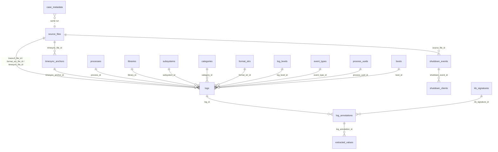

# Analysis database schema

Reference for the SQLite database produced by [`extract`](../cli/extract.md). Source
of truth: `forensic_aul/engine/database/schema.py` (DDL), `writer.py` (inserts),
`ordering.py` (the two ordering columns), plus the annotation tables created by
`forensic_aul/ops/annotation/matcher.py`.

## Stable surface vs internal schema

| Layer | What it is | Stability |
|---|---|---|
| `query_logs` / `LogStore` (`forensic_aul.ops.query`) | Python read API returning `LogRow` objects | Stable — the recommended consumer entry point |
| `v_logs` view | Denormalised read view over `logs` + its lookup tables | Stable — columns are only ever **appended** |
| `logs`, `processes`, `subsystems`, `format_strs`, … | The normalised tables and their `*_id` FKs | **Internal** — may change between versions |

`schema.py` states the rule explicitly: `v_logs` (together with the `query_logs`
API) is *"the ONLY schema surface external consumers may rely on"*. Raw-SQL
consumers should read `v_logs`; everything below is documented so an investigator
can audit provenance, not as an interface contract.

`ensure_views()` is idempotent and is called opportunistically by `query_logs`, so
a database created before the view existed gains it on first read (silently
skipped on a read-only file).

## Entity relationships



Every foreign key is an `INTEGER` (SQLite rowid alias) — chosen so the
high-repetition string columns are stored once in a lookup table instead of on
each of the tens of millions of `logs` rows.

---

## `logs`

The main table: one row per parsed log entry.

| Column | Type | Meaning |
|---|---|---|
| `id` | INTEGER PK | rowid alias (no `AUTOINCREMENT`) |
| `source_order` | INTEGER | Physical position **within its own tracev3 file** (1-based, byte order). NULL until the ordering pass runs |
| `event_order` | INTEGER | Merged real timeline: `(boot physical rank, timestamp_mach)`. NULL until the ordering pass runs |
| `tracev3_file_id` | INTEGER FK → `source_files.id` | File the raw Firehose entry came from |
| `format_src_file_id` | INTEGER FK → `source_files.id` | UUIDText or DSC file that supplied the format string |
| `timesync_file_id` | INTEGER FK → `source_files.id` | `.timesync` file used for the timestamp conversion |
| `tracev3_chunkset_file_offset` | INTEGER | Offset of the chunkset within the tracev3 file |
| `tracev3_firehose_inner_offset` | INTEGER | Offset of the firehose preamble in the decompressed chunkset |
| `tracev3_entry_inner_offset` | INTEGER | Offset of this entry within the firehose preamble |
| `format_string_file_offset` | INTEGER | Offset of the format string in the UUIDText/DSC file — NULL for a dynamic format |
| `timestamp_unix_ns` | INTEGER NOT NULL | Nanoseconds since 1970-01-01 UTC. **`0` is the failure sentinel** (unresolved timestamp) |
| `timestamp_mach` | INTEGER NOT NULL | Raw mach continuous time (kernel ticks) |
| `timesync_anchor_id` | INTEGER FK → `timesync_anchors.id` | The anchor used to derive `timestamp_unix_ns` |
| `process_id` | INTEGER FK → `processes.id` | |
| `pid`, `tid`, `euid` | INTEGER | Process / thread / effective-uid |
| `log_level_id` | INTEGER FK → `log_levels.id` | |
| `event_type_id` | INTEGER FK → `event_types.id` | |
| `subsystem_id` | INTEGER FK → `subsystems.id` | |
| `category_id` | INTEGER FK → `categories.id` | |
| `message` | TEXT | The composed (rendered) message |
| `format_str_id` | INTEGER FK → `format_strs.id` | The invariant format-string template |
| `library_id` | INTEGER FK → `libraries.id` | |
| `process_uuid_id` | INTEGER FK → `process_uuids.id` | Process image UUID |
| `activity_id`, `parent_activity_id` | INTEGER | |
| `boot_id` | INTEGER FK → `boots.id` | Normalised boot UUID; its `rank` drives `event_order` |
| `raw_data` | TEXT | JSON list of the decoded firehose items. **Only populated with `extract --keep-raw`**; NULL otherwise |

Notes:

- **No ISO timestamp column.** The human-readable string is derived on read from
  `timestamp_unix_ns` (`engine/utils/time.iso8601_from_unix_ns`), saving ~30 bytes
  per row. The read layer emits `""` — not a 1970 date — for the `0` sentinel.
- All FK columns are nullable; an unresolved lookup simply leaves NULL.
- `source_order` / `event_order` are assigned **after** the bulk load, so they are
  independent of insertion order (and therefore of how many parser processes ran).
  An interrupted extract can leave them NULL.

### Ordering semantics

`ordering.py` computes both columns in one pass:

- `source_order` — `ROW_NUMBER() PARTITION BY tracev3_file_id ORDER BY (chunkset
  offset, firehose inner offset, entry inner offset, id)`. Combined with
  `tracev3_file_id` it pinpoints a record's exact slot in its own stream.
- `event_order` — `ROW_NUMBER() ORDER BY (COALESCE(boots.rank, UNKNOWN_BOOT_RANK),
  timestamp_mach, tracev3_file_id, offsets…, id)`.

`event_order` is ordered by the **monotonic** mach clock, never wall-clock. That
is the point: a backwards jump in the derived ISO timestamp while `event_order`
keeps rising is the clock-tampering signal. Boot order comes from the *physical*
timesync layout (`boots.rank`), not from a wall-clock boot time that a clock reset
could reorder. `UNKNOWN_BOOT_RANK` (`1 << 30`) is given to a boot seen in the logs
but absent from the timesync layout, so it sorts after every known boot.

### Indexes on `logs`

Deliberately lean — each index on a tens-of-millions-row table costs storage and a
full sorted build:

| Index | Column |
|---|---|
| `idx_logs_timestamp_unix_ns` | `timestamp_unix_ns` |
| `idx_logs_subsystem_id` | `subsystem_id` |
| `idx_logs_category_id` | `category_id` |
| `idx_logs_process_id` | `process_id` |
| `idx_logs_format_str_id` | `format_str_id` |
| `idx_logs_event_order` | `event_order` |

Not indexed on purpose: `log_level_id` / `event_type_id` (never selective),
`boot_id` (only sorted, and `event_order` already leads with its rank), `pid`,
`timestamp_mach`, and the provenance file-id columns.

During a bulk extract these are deferred (`init_schema(create_indexes=False)`) and
built afterwards by `finalize_indexes()`.

---

## `case_metadata`

One row per extraction session.

| Column | Type | Meaning |
|---|---|---|
| `id` | INTEGER PK | |
| `case_number`, `imei`, `exhibit_number`, `analyst_name` | TEXT | Operator-supplied case identifiers (`CaseInfo`) |
| `ios_model` | TEXT | |
| `ios_build_version` | TEXT | Build code from the tracev3 header (e.g. `21F90`) |
| `ios_version` | TEXT | Marketing iOS version (from `SystemVersion.plist`, or a build-table fallback) |
| `log_start_time`, `log_end_time` | TEXT | ISO 8601 UTC bounds of the parsed logs |
| `notes` | TEXT | |
| `source_path` | TEXT | The evidence supplied (dir / `.tar.gz` / `.zip` / `.faul`) |
| `source_type` | TEXT | e.g. `logarchive`, `sysdiagnose`, `filesystem` |
| `source_fingerprint` | TEXT | Quick head+tail+size archive fingerprint (NULL for a directory) |
| `logarchive_path` | TEXT | Logarchive root parsed (a placeholder when a temp dir was used) |
| `logarchive_sha256` | TEXT | |
| `log_file_path` | TEXT | Path of the operational log file for the run |
| `log_file_sha256` | TEXT | SHA-256 of that log file, sealed at end of run |
| `acquisition_timestamp` | TEXT NOT NULL | ISO 8601, written at insert |
| `tool_version` | TEXT NOT NULL | |

`ios_model`, `ios_build_version`, `ios_version`, the two log-time bounds and the
two `log_file_*` columns are filled in by `update_case_metadata` later in the run,
so they are NULL on an interrupted extract.

## `source_files`

One row per parsed file, and the per-file integrity record.

| Column | Type | Meaning |
|---|---|---|
| `id` | INTEGER PK | |
| `file_path` | TEXT NOT NULL UNIQUE | Path relative to the logarchive root |
| `file_type` | TEXT NOT NULL | `tracev3` \| `uuidtext` \| `dsc` \| `timesync` |
| `sha256` | TEXT | "Before" digest, captured at registration (NULL when hashing is off) |
| `sha256_after` | TEXT | Re-hash at end of run |
| `integrity_ok` | INTEGER | `1` unchanged, `0` **changed during the run**, `NULL` no baseline or unreadable |
| `file_size` | INTEGER | |
| `parsed_at` | TEXT NOT NULL | ISO 8601 |

A `0`/`NULL` on one file does not invalidate the others — each row stays
independently usable, and the flag pinpoints exactly which file to distrust. The
hashing depth is controlled by `extract --integrity` (`full` / `fingerprint` /
`off`); see [verify-hash](../cli/verify-hash.md).

## Lookup tables

| Table | Columns | Notes |
|---|---|---|
| `processes` | `id`, `name` UNIQUE | |
| `libraries` | `id`, `name`, `uuid`, UNIQUE(`name`,`uuid`) | |
| `subsystems` | `id`, `name` UNIQUE | |
| `categories` | `id`, `name` UNIQUE | |
| `format_strs` | `id`, `value` UNIQUE | Raw format-string template |
| `process_uuids` | `id`, `uuid` UNIQUE | One row per distinct process image UUID |
| `log_levels` | `id`, `name` UNIQUE | **Seeded**, 1-based in order: `Default`, `Info`, `Debug`, `Error`, `Fault` |
| `event_types` | `id`, `name` UNIQUE | **Seeded**, 1-based in order: `Log`, `Activity`, `Trace`, `Signpost`, `Loss`, `Statedump`, `Simpledump` |
| `boots` | `id`, `boot_uuid` UNIQUE, `rank` NOT NULL | `rank` = physical first-appearance order across the name-sorted timesync files |

`Statedump` / `Simpledump` are non-Firehose records (tags `0x6003` / `0x6004`)
appended after the firehose vocabulary so the original ids stay stable.

## `timesync_anchors`

One row per *unique* timesync anchor used during conversion (a boot anchor serves
an entire boot; a record anchor serves its kernel-time window).

| Column | Type | Meaning |
|---|---|---|
| `id` | INTEGER PK | |
| `timesync_file_id` | INTEGER NOT NULL FK → `source_files.id` | |
| `file_offset` | INTEGER NOT NULL | Byte offset of the anchor in that file |
| `boot_uuid` | TEXT NOT NULL | |
| `kernel_continuous_time` | INTEGER NOT NULL | |
| `walltime_unix_ns` | INTEGER NOT NULL | |
| `timebase_numerator`, `timebase_denominator` | INTEGER NOT NULL | Mach timebase |
| `timezone_offset_mins` | INTEGER | Nullable |

`UNIQUE (timesync_file_id, file_offset)` — byte-level provenance is the natural
deduplication key.

## `shutdown_events` / `shutdown_clients`

Parsed from the `shutdown.log` sidecar (Extra/ in a logarchive or sysdiagnose, the
diagnostics root in an FFS). These are **wall-clock anchored** (a Unix epoch from
the `SIGTERM: [<epoch>]` line) and carry no mach time or boot, so they live outside
the `logs` / `event_order` timeline and correlate to logs by wall-clock only.

`shutdown_events`

| Column | Type | Meaning |
|---|---|---|
| `id` | INTEGER PK | |
| `source_file_id` | INTEGER FK → `source_files.id` | The `shutdown.log` |
| `shutdown_unix_ns` | INTEGER NOT NULL | Power-off time (SIGTERM epoch × 1e9) |
| `shutdown_iso` | TEXT NOT NULL | ISO 8601 UTC |
| `delay_seconds` | REAL | Longest still-alive check = total shutdown delay |
| `client_count` | INTEGER NOT NULL | Distinct processes that lingered at any check |

`shutdown_clients`

| Column | Type | Meaning |
|---|---|---|
| `id` | INTEGER PK | |
| `shutdown_event_id` | INTEGER NOT NULL FK → `shutdown_events.id` | |
| `pid` | INTEGER | |
| `process_path` | TEXT | |
| `lingered_seconds` | REAL | Last "After Xs" check the process was still alive at |

Indexes: `idx_shutdown_events_time(shutdown_unix_ns)`,
`idx_shutdown_clients_event(shutdown_event_id)`,
`idx_shutdown_clients_path(process_path)` — created inline (these tables are tiny).

---

## `v_logs` (stable view)

```sql
CREATE VIEW v_logs AS
SELECT l.id, l.timestamp_unix_ns, l.source_order, l.event_order,
       p.name AS process, l.pid, l.tid,
       ll.name AS log_level, et.name AS event_type,
       s.name AS subsystem, c.name AS category,
       l.message, fs.value AS format_string, b.boot_uuid
FROM logs l
LEFT JOIN processes p … LEFT JOIN boots b ON b.id = l.boot_id;
```

Columns: `id`, `timestamp_unix_ns`, `source_order`, `event_order`, `process`,
`pid`, `tid`, `log_level`, `event_type`, `subsystem`, `category`, `message`,
`format_string`, `boot_uuid`. The view carries no ISO timestamp — format
`timestamp_unix_ns` yourself, and treat `0` as "unresolved".

## `logs_fts` (FTS5, optional)

```sql
CREATE VIRTUAL TABLE logs_fts USING fts5(message, content='logs', content_rowid='id');
```

An **external-content** FTS5 index over `logs.message`, plus `logs_ai` / `logs_ad` /
`logs_au` triggers that keep it in sync on INSERT / DELETE / UPDATE.

- Created only when `extract --fts` is in effect (`fts=True` is the library
  default) **and** the SQLite build reports `ENABLE_FTS5` in `PRAGMA
  compile_options`. Otherwise the table is absent and a warning is logged.
- With `--fast-fts` the virtual table is created but its triggers are deferred; a
  single `INSERT INTO logs_fts(logs_fts) VALUES('rebuild')` populates it at the end
  of the run (`finalize_deferred_fts`), then the triggers are installed. A run
  interrupted before that finaliser leaves the index empty.
- Consumers must probe with `has_fts_index()` (`ops/query/reader.py`), which checks
  the shadow table `logs_fts_docsize` — a plain scan of an external-content table
  would report an emptied index as populated. The `message_match` filter **raises**
  rather than silently falling back to a `LIKE` scan when no usable index exists.

## Annotation tables (created by `annotate`)

These do not exist until [`annotate`](../cli/annotate.md) has run; probe with
`has_kb_tables()` (both `log_annotations` and `kb_signatures` must be present).

`kb_signatures` — one row per signature that produced ≥ 1 hit, per annotate run.

| Column | Type | Meaning |
|---|---|---|
| `id` | INTEGER PK | |
| `signature_id` | TEXT NOT NULL | The YAML signature id, e.g. `sb.app_foreground` |
| `action` | TEXT NOT NULL | Human-readable action the signature asserts |
| `description` | TEXT | |
| `confidence` | TEXT | `low` \| `medium` \| `high` |
| `tags` | TEXT | JSON list (queried with `json_each`) |
| `source_file` | TEXT | KB-relative YAML path |
| `kb_version` | TEXT NOT NULL | Contents of the KB `VERSION` file |
| `kb_sha256` | TEXT NOT NULL | Rolling digest of the KB tree |
| `applied_at` | TEXT NOT NULL | ISO 8601 UTC, microsecond precision |
| `match_count` | INTEGER NOT NULL DEFAULT 0 | Updated after the signature finishes |

`UNIQUE (signature_id, kb_sha256, applied_at)` — microsecond `applied_at` is what
lets an identical re-run within the same second succeed.

`log_annotations` — the join table.

| Column | Type |
|---|---|
| `id` | INTEGER PK |
| `log_id` | INTEGER NOT NULL FK → `logs.id` |
| `kb_signature_id` | INTEGER NOT NULL FK → `kb_signatures.id` |

Indexes: `idx_log_annotations_log_id`, `idx_log_annotations_kb_id`.

`extracted_values` — one row per (label, value) pulled out of a matched message.

| Column | Type |
|---|---|
| `id` | INTEGER PK |
| `log_annotation_id` | INTEGER NOT NULL FK → `log_annotations.id` |
| `label` | TEXT NOT NULL |
| `value` | TEXT |

Indexes: `idx_extracted_values_annot`, `idx_extracted_values_label`. Stored as an
EAV table (not a JSON blob) so values are directly SQL-queryable; the export pivots
them into one column per label (see [export formats](export-formats.md)).

## Pragmas

`apply_pragmas()` sets, before any write: `journal_mode=WAL`,
`synchronous=NORMAL` (`OFF` only with `extract --fast-write`), `foreign_keys=ON`,
`cache_size=-65536` (64 MB), `temp_store=MEMORY`, a raised `wal_autocheckpoint`,
and optionally `PRAGMA threads` for parallel sorts.

---

## Example queries

Read through the stable view:

```sql
SELECT timestamp_unix_ns, process, subsystem, message
FROM v_logs
WHERE subsystem = 'com.apple.wifi'
ORDER BY event_order
LIMIT 50;
```

Spot a wall-clock jump backwards while the forensic sequence keeps rising:

```sql
SELECT event_order, timestamp_unix_ns, process, message
FROM v_logs a
WHERE timestamp_unix_ns > 0
  AND timestamp_unix_ns < (
      SELECT MAX(b.timestamp_unix_ns) FROM v_logs b
      WHERE b.event_order < a.event_order AND b.timestamp_unix_ns > 0
  )
ORDER BY event_order;
```

Distinct values extracted under one label:

```sql
SELECT DISTINCT value FROM extracted_values WHERE label = 'ssid';
```

Annotated lines with their signature and action:

```sql
SELECT l.timestamp_unix_ns, kbs.signature_id, kbs.action, l.message
FROM logs l
JOIN log_annotations la ON la.log_id = l.id
JOIN kb_signatures  kbs ON kbs.id = la.kb_signature_id
ORDER BY l.timestamp_unix_ns;
```

Files that changed under the tool during the run:

```sql
SELECT file_path, sha256, sha256_after
FROM source_files
WHERE integrity_ok = 0;
```

Keyword search via the full-text index (requires an extract with FTS):

```sql
SELECT id, message FROM logs
WHERE id IN (SELECT rowid FROM logs_fts WHERE logs_fts MATCH '"airdrop"');
```

## See also

- [Export formats](export-formats.md) — the CSV/JSON shape derived from these tables
- [Knowledge base](knowledge-base.md) — what fills `kb_signatures` / `extracted_values`
- [Identify database](identify-database.md) — the separate diff database
- [Library API](../library/index.md) — `query_logs`, `LogStore`, `LogRow`
